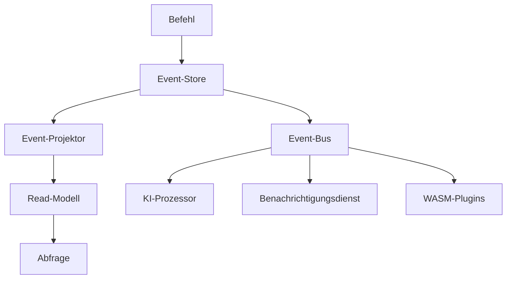

# Atomo Content Core

[English](README.md) · [简体中文](README.zh-CN.md) · [Español](README.es.md) · [日本語](README.ja.md) · [Français](README.fr.md) · **Deutsch**

> Content-Management-Plattform der nächsten Generation — Event-Sourcing-Architektur + KI-native Konzeption

[](https://github.com/atomo-cc/atomo/actions)
[](https://github.com/atomo-cc/atomo/releases)
[](https://opensource.org/licenses/MIT)

Atomo ist eine moderne Content-Management-Plattform, die auf einer Event-Sourcing-Architektur aufbaut und KI-Integration nativ unterstützt. Sie bietet eine leistungsstarke, skalierbare Content-Management-Lösung für Anwendungen auf Unternehmensniveau.

## ✨ Kernfunktionen

- 🔄 **Event-Sourcing-Architektur**: Vollständige Nachverfolgung der Datenhistorie und Zeitreise
- 🧠 **KI-native Konzeption**: Integrierte KI-Workflows und intelligente Inhaltsverarbeitung
- 🎯 **Flaggschiff-App-getrieben**: Plattformentwicklung, angetrieben von einer echten CRM-Anwendung
- 🔧 **Dual-Mode-Definition**: TypeScript-Schema + Rust-Codegenerierung
- 🚀 **Hohe Leistung**: Rust-Backend + ein moderner Frontend-Stack
- 🔌 **Plugin-fähige Architektur**: WASM-Plugin-System mit mehrsprachiger Erweiterungsunterstützung
- 🧩 **Erweitern ohne Fork**: deklarierbare Schema-Constraints (`@unique` / `@@check` / partiell) + von Plugins bereitgestellte benutzerdefinierte HTTP-Routen (`/ext/<plugin>`)
- 📊 **Echtzeit-Zusammenarbeit**: WebSocket-gesteuerte Echtzeit-Datensynchronisation

## 🚀 Schnellstart

### CLI installieren

```bash
# Über Cargo installieren
cargo install atomo_cli

# Oder eine vorkompilierte Binärdatei herunterladen
curl -L https://github.com/atomo-cc/atomo/releases/latest/download/atomo-linux-x86_64 -o atomo
chmod +x atomo
```

### Neues Projekt erstellen

```bash
# CRM-App erstellen
atomo init my-crm --template crm

# Blog-App erstellen
atomo init my-blog --template blog

# E-Commerce-App erstellen
atomo init my-shop --template ecommerce
```

### Entwickeln und bereitstellen

```bash
cd my-crm

# Entwicklungsserver starten (in einem Service-Verzeichnis)
atomo dev

# Workspace-Modus (im Repo-Stammverzeichnis oder einem angegebenen Service)
atomo dev --workspace [--service-path services/<name>]

# Für die Produktion bauen
atomo build

# In die Cloud bereitstellen
atomo deploy
```

## Frontend

```bash
pnpm install

# Terminal 1: Admin UI
pnpm dev:admin

# Terminal 2: Watch/Build-Schleife des TypeScript-SDK
pnpm --filter @atomo-cc/client-sdk dev

# Source of Truth der CRM-Demo
cd services/crm-service
pnpm generate
```

Empfohlene MVP-Schleife:
1. Passe das CRM-Datenmodell in `services/crm-service/schema.ts` an.
2. Führe `pnpm --filter atomo-crm-service generate` aus, um die CRM-Generate zu aktualisieren.
3. Führe `pnpm --filter @atomo-cc/client-sdk build` aus, um die Typ-Ausgabe des SDK zu prüfen.
4. Nutze `pnpm dev:admin`, um zu prüfen, wie die Admin UI das generierte Schema/Metadata konsumiert.

Sowohl `packages/atomo-admin-ui` als auch `packages/atomo-client-sdk` sollten die Typprüfung grün halten; prüfe die Frontend-/SDK-Baseline mit `pnpm --filter "./packages/*" test`.

## 📁 Projektstruktur

```
atomo/
├── crates/                    # Rust-Kernbibliotheken
│   ├── atomo_core/           # 🔧 Kern-Domänenmodelle und Events
│   ├── atomo_cli/            # 🖥️  Kommandozeilen-Tool
│   ├── atomo_server/         # 🌐 Webserver
│   ├── atomo_schema/         # 📝 Schema-Parser
│   ├── atomo_projectors/     # 📊 Event-Projektoren
│   ├── atomo_realtime/       # 📡 Flüchtige Echtzeit-Kanäle und Präsenz
│   └── atomo_wasm_runtime/   # 🔌 WASM-Plugin-Runtime
├── packages/                  # Frontend-Pakete
│   ├── atomo-client-sdk/     # 📚 Client-SDK
│   └── atomo-admin-ui/       # 🎛️  Admin-Oberfläche
│   └── atomo-crm-app/        # 💼 CRM-Flaggschiff-App
├── templates/                 # 📋 Projektvorlagen
│   ├── crm/                  # CRM-Vorlage
│   ├── blog/                 # Blog-Vorlage
│   └── ecommerce/            # E-Commerce-Vorlage
├── services/
│   └── crm-service/          # 💼 CRM-Demo-Service
└── docs/                      # 📄 Dokumentation
```

## 🏗️ Architektur

### Event Sourcing + CQRS



### Technologie-Stack

- **Backend**: Rust + Axum + async-graphql + PostgreSQL
- **Frontend**: TypeScript + React + Tailwind CSS
- **Daten**: Event Sourcing + PostgreSQL + Redis
- **KI**: OpenAI-API + Unterstützung lokaler Modelle
- **Bereitstellung**: Docker + Kubernetes + GitHub Actions

## 🎯 Anwendungsfälle

### 1. Unternehmens-CRM

```typescript
// CRM-Schema definieren
export interface Contact {
  id: string;
  name: string;
  email: string;
  company?: Company;
  deals: Deal[];
}

export interface Company {
  id: string;
  name: string;
  size: CompanySize;
  industry: string;
}
```

### 2. Content-Management-System

```typescript
// Content-Schema definieren
export interface Article {
  id: string;
  title: string;
  content: string;
  author: User;
  tags: string[];
  publishedAt?: Date;
}
```

### 3. E-Commerce-Plattform

```typescript
// Produkt-Schema definieren
export interface Product {
  id: string;
  name: string;
  price: number;
  inventory: number;
  categories: Category[];
}
```

## 🔧 Entwicklungsleitfaden

### Lokale Entwicklungsumgebung

```bash
# Abhängigkeiten installieren
git clone https://github.com/atomo-cc/atomo.git
cd atomo
cargo build
pnpm install

# Entwicklungsserver starten
cargo run -p atomo_cli -- dev

# Frontend

git clone https://github.com/atomo-cc/atomo.git
cd atomo
pnpm install

# Aktuell empfohlene Entwicklungs-Einstiegspunkte
pnpm dev:admin
pnpm --filter @atomo-cc/client-sdk dev
pnpm --filter atomo-crm-service generate
```

### Schema-getriebene Entwicklung

1. **Schema definieren**
   ```typescript
   // atomo/schema.ts
   export interface User {
     id: string;
     name: string;
     email: string;
   }
   ```

2. **Code generieren**
   ```bash
   atomo codegen
   ```

3. **Generierten Code verwenden**
   ```rust
   use atomo_core::entities::User;

   async fn create_user(name: String, email: String) -> Result<User, Error> {
       // Automatisch generierte CRUD-Operationen
   }
   ```

### Plugin-Entwicklung

```rust
// WASM-Plugin-Beispiel
use atomo_wasm_runtime::*;

#[wasm_bindgen]
pub fn process_content(content: &str) -> String {
    // Eigene Logik zur Inhaltsverarbeitung
    content.to_uppercase()
}
```

Die detaillierte Roadmap und den aktuellen Fortschritt findest du in docs/roadmap.md; die Plattformvision und Architektur in docs/vision.md.

## 📊 Leistungsziele

| Kennzahl | Ziel |
|------|------|
| Durchsatz gleichzeitiger Anfragen | 10.000+ RPS |
| Kaltstartzeit | < 100 ms |
| Speicherbedarf | < 50 MB |
| Latenz der Event-Verarbeitung | < 10 ms |

## 🗺️ Roadmap

### Phase 1: Grundlagen (✅ Abgeschlossen)
- [x] Monorepo-Einrichtung
- [x] Kern-Domänenmodelle
- [x] CLI-Werkzeuge (init, dev, migrate, codegen, test, deploy)
- [x] Event-Sourcing-Grundlage (event_log, Replay, Entitätshistorie)
- [x] Schema-Parser (TypeScript → Rust/GraphQL)
- [x] Basis-CRUD (dynamisches SQL, parametrisierte Abfragen)
- [x] GraphQL-Subscriptions (WebSocket, Modellfilterung)
- [x] AuthN/AuthZ (Argon2id, JWT, RBAC auf der GraphQL-Ebene erzwungen; Aufrufer der Datenebene noch offen, OAuth2/OIDC)
- [x] Soft Delete, Pagination, Beziehungsauflösung
- [x] Eingabevalidierung, strukturierte Fehler
- [x] Ratenbegrenzung, Request-Tracing

### Phase 2: Intelligenz-Upgrade (größtenteils abgeschlossen)
- [x] WASM-Plugin-System (Sandbox, Berechtigungen, Lifecycle-Hooks) + JS-Skript-Plugins (Javy)
- [x] Erweiterbarkeit ohne Fork: deklarierbare Schema-Constraints (`@unique`/`@index`/`@@check`, inkl. partiell mit `WHERE`) + von Plugins bereitgestellte benutzerdefinierte HTTP-Routen (`/ext/<plugin>`)
- [x] CQRS-Read-Projektionen (eventgesteuerte materialisierte Views; Löschungen/numerische Korrekturen siehe B2)
- [x] Read-Cache (TTL + Event-Invalidierung)
- [x] Datei-Upload/-Speicherung (`File`-Feld, multipart, Content-Type-Validierung + Magic-Byte-Sniffing, event-sourced; lokales Backend ✅, S3-Backend hinter dem `storage-s3`-Feature; siehe docs/guide/advanced/upload-storage-plan)
- [~] Workflow-Engine (Trigger, Bedingungen, Retries, YAML-Laden, HTTP-Schritte; Mutation-/Plugin-Schritte noch zu implementieren)
- [~] Mandantenisolierung (`tenant_id`-Spalte + Lese-/Schreibtrennung; Subscription-Filterung / Benutzerbindung / PG RLS noch zu implementieren)
- [~] KI-Workflow-Integration (pgvector EmbeddingStore; noch nicht durchgängig verifiziert, erfordert eine pgvector-Umgebung)
- [~] Local-First-SDK (Offline-Queue, Resync bei erneuter Verbindung; noch keine Integrationstests)

> Der tatsächliche Verifizierungsstatus jeder Fähigkeit richtet sich nach der CRM-Konformitätstest-Suite; siehe docs/guide/advanced/crm-conformance-plan.

### Phase 3: Ökosystem (in Arbeit)
- [x] OAuth2/OIDC-SSO (Google, GitHub, Microsoft, Okta)
- [x] Projektvorlagen (CRM, Blog, E-Commerce)
- [x] Workflow-Designer (Admin-UI-Editor: Trigger-/Schritt-/Aktionsformulare + Ablaufvorschau)
- [ ] Plugin-Marktplatz
- [ ] Verwaltete Plattform Atomo Cloud

## 🤝 Mitwirken

Wir freuen uns über Beiträge der Community! Bitte lies unseren [Leitfaden für Beiträge](CONTRIBUTING.md), um zu erfahren, wie du mitmachen kannst.

### Schneller Beitrag

1. Forke das Projekt
2. Erstelle einen Feature-Branch: `git checkout -b feature/amazing-feature`
3. Committe deine Änderungen: `git commit -m 'Add amazing feature'`
4. Pushe den Branch: `git push origin feature/amazing-feature`
5. Öffne einen Pull Request

## 📚 Dokumentation

- [Benutzerhandbuch](docs/user-guide.md)
- [API-Dokumentation](docs/api.md)
- [Bereitstellungsleitfaden](docs/deployment.md)
- [Plugin-Entwicklung](docs/plugins.md)

## 💬 Community

- **GitHub Issues**: Fehler melden und Funktionswünsche
- **GitHub Discussions**: Technische Diskussion und Fragen/Antworten
- **Discord**: Echtzeit-Chat (in Kürze)

## 📄 Lizenz

Dieses Projekt steht unter der [MIT-Lizenz](LICENSE).

## 🙏 Danksagung

Dank an alle Mitwirkenden und die folgenden Open-Source-Projekte:

- [Rust](https://rust-lang.org/) — Systemprogrammiersprache
- [Axum](https://github.com/tokio-rs/axum) — Web-Framework
- [async-graphql](https://github.com/async-graphql/async-graphql) — GraphQL-Server
- [React](https://react.dev/) — Frontend-Framework

---

**Mach Content-Management einfach und leistungsstark!** 🚀

[Loslegen](https://github.com/atomo-cc/atomo/releases) | [Dokumentation lesen](docs/) | [Der Community beitreten](https://github.com/atomo-cc/atomo/discussions)
