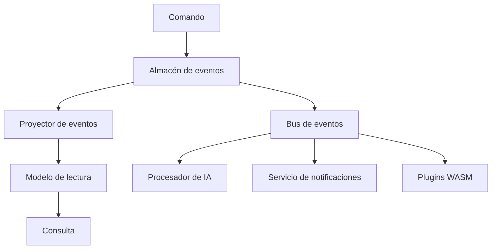

# Atomo Content Core

[English](README.md) · [简体中文](README.zh-CN.md) · **Español** · [日本語](README.ja.md) · [Français](README.fr.md) · [Deutsch](README.de.md)

> Plataforma de gestión de contenidos de nueva generación — arquitectura basada en event sourcing + diseño nativo de IA

[](https://github.com/atomo-cc/atomo/actions)
[](https://github.com/atomo-cc/atomo/releases)
[](https://opensource.org/licenses/MIT)

Atomo es una plataforma moderna de gestión de contenidos construida sobre una arquitectura de event sourcing con integración nativa de IA, que ofrece una solución de gestión de contenidos de alto rendimiento y escalable para aplicaciones de nivel empresarial.

## ✨ Características principales

- 🔄 **Arquitectura basada en event sourcing**: Seguimiento completo del historial de datos y viaje en el tiempo
- 🧠 **Diseño nativo de IA**: Flujos de trabajo de IA integrados y procesamiento inteligente de contenidos
- 🎯 **Impulsado por una app insignia**: Evolución de la plataforma impulsada por una aplicación CRM real
- 🔧 **Definición de modo dual**: Esquema TypeScript + generación de código Rust
- 🚀 **Alto rendimiento**: Backend en Rust + un stack de frontend moderno
- 🔌 **Arquitectura de plugins**: Sistema de plugins WASM con soporte de extensión multilenguaje
- 🧩 **Extender sin forkear**: restricciones de esquema declarables (`@unique` / `@@check` / parciales) + rutas HTTP personalizadas servidas por plugins (`/ext/<plugin>`)
- 📊 **Colaboración en tiempo real**: Sincronización de datos en tiempo real impulsada por WebSocket

## 🚀 Inicio rápido

### Instalar la CLI

```bash
# Instalar mediante Cargo
cargo install atomo_cli

# O descargar un binario precompilado
curl -L https://github.com/atomo-cc/atomo/releases/latest/download/atomo-linux-x86_64 -o atomo
chmod +x atomo
```

### Crear un nuevo proyecto

```bash
# Crear una app CRM
atomo init my-crm --template crm

# Crear una app de blog
atomo init my-blog --template blog

# Crear una app de comercio electrónico
atomo init my-shop --template ecommerce
```

### Desarrollar e implementar

```bash
cd my-crm

# Iniciar el servidor de desarrollo (dentro de un directorio de servicio)
atomo dev

# Modo workspace (en la raíz del repo o un servicio especificado)
atomo dev --workspace [--service-path services/<name>]

# Compilar para producción
atomo build

# Desplegar en la nube
atomo deploy
```

## Frontend

```bash
pnpm install

# Terminal 1: Admin UI
pnpm dev:admin

# Terminal 2: bucle watch/build del SDK de TypeScript
pnpm --filter @atomo-cc/client-sdk dev

# Fuente de verdad de la demo CRM
cd services/crm-service
pnpm generate
```

Bucle MVP recomendado:
1. Ajusta el modelo de datos CRM en `services/crm-service/schema.ts`.
2. Ejecuta `pnpm --filter atomo-crm-service generate` para regenerar la salida del CRM.
3. Ejecuta `pnpm --filter @atomo-cc/client-sdk build` para verificar la salida de tipos del SDK.
4. Usa `pnpm dev:admin` para comprobar cómo la Admin UI consume el schema/metadata generados.

Tanto `packages/atomo-admin-ui` como `packages/atomo-client-sdk` deben mantener el type-check en verde; verifica la línea base de frontend/SDK con `pnpm --filter "./packages/*" test`.

## 📁 Estructura del proyecto

```
atomo/
├── crates/                    # Bibliotecas core de Rust
│   ├── atomo_core/           # 🔧 Modelos de dominio y eventos core
│   ├── atomo_cli/            # 🖥️  Herramienta de línea de comandos
│   ├── atomo_server/         # 🌐 Servidor web
│   ├── atomo_schema/         # 📝 Analizador de esquemas
│   ├── atomo_projectors/     # 📊 Proyectores de eventos
│   ├── atomo_realtime/       # 📡 Canales en tiempo real efímeros y presencia
│   └── atomo_wasm_runtime/   # 🔌 Runtime de plugins WASM
├── packages/                  # Paquetes de frontend
│   ├── atomo-client-sdk/     # 📚 SDK de cliente
│   └── atomo-admin-ui/       # 🎛️  Interfaz de administración
│   └── atomo-crm-app/        # 💼 App insignia CRM
├── templates/                 # 📋 Plantillas de proyecto
│   ├── crm/                  # Plantilla CRM
│   ├── blog/                 # Plantilla de blog
│   └── ecommerce/            # Plantilla de comercio electrónico
├── services/
│   └── crm-service/          # 💼 Servicio demo CRM
└── docs/                      # 📄 Documentación
```

## 🏗️ Arquitectura

### Event Sourcing + CQRS



### Stack tecnológico

- **Backend**: Rust + Axum + async-graphql + PostgreSQL
- **Frontend**: TypeScript + React + Tailwind CSS
- **Datos**: Event sourcing + PostgreSQL + Redis
- **IA**: API de OpenAI + soporte de modelos locales
- **Despliegue**: Docker + Kubernetes + GitHub Actions

## 🎯 Casos de uso

### 1. CRM empresarial

```typescript
// Definir el esquema CRM
export interface Contact {
  id: string;
  name: string;
  email: string;
  company?: Company;
  deals: Deal[];
}

export interface Company {
  id: string;
  name: string;
  size: CompanySize;
  industry: string;
}
```

### 2. Sistema de gestión de contenidos

```typescript
// Definir el esquema de contenido
export interface Article {
  id: string;
  title: string;
  content: string;
  author: User;
  tags: string[];
  publishedAt?: Date;
}
```

### 3. Plataforma de comercio electrónico

```typescript
// Definir el esquema de producto
export interface Product {
  id: string;
  name: string;
  price: number;
  inventory: number;
  categories: Category[];
}
```

## 🔧 Guía de desarrollo

### Entorno de desarrollo local

```bash
# Instalar dependencias
git clone https://github.com/atomo-cc/atomo.git
cd atomo
cargo build
pnpm install

# Iniciar el servidor de desarrollo
cargo run -p atomo_cli -- dev

# Frontend

git clone https://github.com/atomo-cc/atomo.git
cd atomo
pnpm install

# Puntos de entrada de desarrollo recomendados actualmente
pnpm dev:admin
pnpm --filter @atomo-cc/client-sdk dev
pnpm --filter atomo-crm-service generate
```

### Desarrollo guiado por esquema

1. **Definir el esquema**
   ```typescript
   // atomo/schema.ts
   export interface User {
     id: string;
     name: string;
     email: string;
   }
   ```

2. **Generar código**
   ```bash
   atomo codegen
   ```

3. **Usar el código generado**
   ```rust
   use atomo_core::entities::User;

   async fn create_user(name: String, email: String) -> Result<User, Error> {
       // Operaciones CRUD generadas automáticamente
   }
   ```

### Desarrollo de plugins

```rust
// Ejemplo de plugin WASM
use atomo_wasm_runtime::*;

#[wasm_bindgen]
pub fn process_content(content: &str) -> String {
    // Lógica personalizada de procesamiento de contenido
    content.to_uppercase()
}
```

Para el roadmap detallado y el progreso actual, consulta docs/roadmap.md; para la visión de la plataforma y la arquitectura, consulta docs/vision.md.

## 📊 Objetivos de rendimiento

| Métrica | Objetivo |
|------|------|
| Rendimiento de solicitudes concurrentes | 10,000+ RPS |
| Tiempo de arranque en frío | < 100ms |
| Uso de memoria | < 50MB |
| Latencia de procesamiento de eventos | < 10ms |

## 🗺️ Roadmap

### Fase 1: Base (✅ Completada)
- [x] Configuración del monorepo
- [x] Modelos de dominio core
- [x] Herramientas CLI (init, dev, migrate, codegen, test, deploy)
- [x] Base de event sourcing (event_log, replay, historial de entidades)
- [x] Analizador de esquemas (TypeScript → Rust/GraphQL)
- [x] CRUD básico (SQL dinámico, consultas parametrizadas)
- [x] Suscripciones GraphQL (WebSocket, filtrado por modelo)
- [x] AuthN/AuthZ (Argon2id, JWT, RBAC aplicado en la capa GraphQL; llamadores de la capa de datos por definir, OAuth2/OIDC)
- [x] Borrado lógico, paginación, resolución de relaciones
- [x] Validación de entrada, errores estructurados
- [x] Limitación de tasa, trazado de solicitudes

### Fase 2: Mejora de inteligencia (mayormente completada)
- [x] Sistema de plugins WASM (sandbox, permisos, hooks de ciclo de vida) + plugins de script JS (Javy)
- [x] Extensibilidad sin fork: restricciones de esquema declarables (`@unique`/`@index`/`@@check`, incl. parciales con `WHERE`) + rutas HTTP personalizadas servidas por plugins (`/ext/<plugin>`)
- [x] Proyecciones de lectura CQRS (vistas materializadas dirigidas por eventos; borrados/correcciones numéricas ver B2)
- [x] Caché de lectura (TTL + invalidación por eventos)
- [x] Subida/almacenamiento de archivos (`File` field, multipart, validación de tipo de contenido + sniffing de magic bytes, event-sourced; backend local ✅, backend S3 tras la feature `storage-s3`; ver docs/guide/advanced/upload-storage-plan)
- [~] Motor de flujos de trabajo (disparadores, condiciones, reintentos, carga YAML, pasos HTTP; pasos Mutation/Plugin por implementar)
- [~] Aislamiento multi-tenant (columna `tenant_id` + aislamiento de lectura/escritura; filtrado de suscripciones / vinculación de usuario / PG RLS por implementar)
- [~] Integración de flujos de IA (pgvector EmbeddingStore; aún no verificado de extremo a extremo, requiere un entorno pgvector)
- [~] SDK local-first (cola offline, sincronización al reconectar; aún sin pruebas de integración)

> El estado real de verificación de cada capacidad se rige por la suite de pruebas de conformidad CRM; ver docs/guide/advanced/crm-conformance-plan.

### Fase 3: Ecosistema (en progreso)
- [x] OAuth2/OIDC SSO (Google, GitHub, Microsoft, Okta)
- [x] Plantillas de proyecto (CRM, blog, comercio electrónico)
- [x] Diseñador de flujos de trabajo (editor de la Admin UI: formularios de disparador/paso/acción + vista previa del flujo)
- [ ] Marketplace de plugins
- [ ] Plataforma gestionada Atomo Cloud

## 🤝 Contribuir

¡Damos la bienvenida a las contribuciones de la comunidad! Lee nuestra [Guía de contribución](CONTRIBUTING.md) para saber cómo participar.

### Contribución rápida

1. Haz un fork del proyecto
2. Crea una rama de funcionalidad: `git checkout -b feature/amazing-feature`
3. Confirma tus cambios: `git commit -m 'Add amazing feature'`
4. Empuja la rama: `git push origin feature/amazing-feature`
5. Abre un Pull Request

## 📚 Documentación

- [Guía de usuario](docs/user-guide.md)
- [Documentación de la API](docs/api.md)
- [Guía de despliegue](docs/deployment.md)
- [Desarrollo de plugins](docs/plugins.md)

## 💬 Comunidad

- **GitHub Issues**: Reporta errores y solicitudes de funcionalidades
- **GitHub Discussions**: Discusión técnica y preguntas/respuestas
- **Discord**: Chat en tiempo real (próximamente)

## 📄 Licencia

Este proyecto está licenciado bajo la [Licencia MIT](LICENSE).

## 🙏 Agradecimientos

Gracias a todos los contribuidores y a los siguientes proyectos de código abierto:

- [Rust](https://rust-lang.org/) — lenguaje de programación de sistemas
- [Axum](https://github.com/tokio-rs/axum) — framework web
- [async-graphql](https://github.com/async-graphql/async-graphql) — servidor GraphQL
- [React](https://react.dev/) — framework de frontend

---

**¡Haz que la gestión de contenidos sea simple y potente!** 🚀

[Empezar](https://github.com/atomo-cc/atomo/releases) | [Leer la documentación](docs/) | [Unirse a la comunidad](https://github.com/atomo-cc/atomo/discussions)
