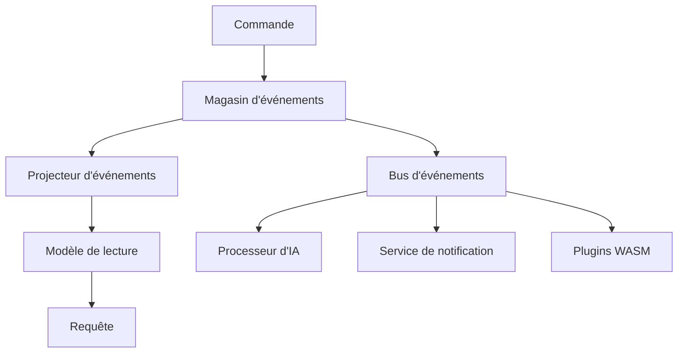

# Atomo Content Core

[English](README.md) · [简体中文](README.zh-CN.md) · [Español](README.es.md) · [日本語](README.ja.md) · **Français** · [Deutsch](README.de.md)

> Plateforme de gestion de contenu nouvelle génération — architecture event sourcing + conception nativement orientée IA

[](https://github.com/atomo-cc/atomo/actions)
[](https://github.com/atomo-cc/atomo/releases)
[](https://opensource.org/licenses/MIT)

Atomo est une plateforme moderne de gestion de contenu bâtie sur une architecture event sourcing avec une intégration native de l'IA, offrant une solution de gestion de contenu performante et évolutive pour les applications d'entreprise.

## ✨ Fonctionnalités clés

- 🔄 **Architecture event sourcing** : Suivi complet de l'historique des données et voyage dans le temps
- 🧠 **Conception nativement orientée IA** : Workflows d'IA intégrés et traitement intelligent du contenu
- 🎯 **Piloté par une application phare** : Évolution de la plateforme guidée par une véritable application CRM
- 🔧 **Définition à double mode** : Schéma TypeScript + génération de code Rust
- 🚀 **Hautes performances** : Backend Rust + une stack frontend moderne
- 🔌 **Architecture à plugins** : Système de plugins WASM avec prise en charge d'extensions multilangages
- 📊 **Collaboration en temps réel** : Synchronisation des données en temps réel pilotée par WebSocket

## 🚀 Démarrage rapide

### Installer la CLI

```bash
# Installer via Cargo
cargo install atomo_cli

# Ou télécharger un binaire précompilé
curl -L https://github.com/atomo-cc/atomo/releases/latest/download/atomo-linux-x86_64 -o atomo
chmod +x atomo
```

### Créer un nouveau projet

```bash
# Créer une application CRM
atomo init my-crm --template crm

# Créer une application de blog
atomo init my-blog --template blog

# Créer une application e-commerce
atomo init my-shop --template ecommerce
```

### Développer et déployer

```bash
cd my-crm

# Démarrer le serveur de développement (dans un répertoire de service)
atomo dev

# Mode workspace (à la racine du dépôt ou un service spécifié)
atomo dev --workspace [--service-path services/<name>]

# Compiler pour la production
atomo build

# Déployer dans le cloud
atomo deploy
```

## Frontend

```bash
pnpm install

# Terminal 1 : Admin UI
pnpm dev:admin

# Terminal 2 : boucle watch/build du SDK TypeScript
pnpm --filter @atomo-cc/client-sdk dev

# Source de vérité de la démo CRM
cd services/crm-service
pnpm generate
```

Boucle MVP recommandée :
1. Ajustez le modèle de données CRM dans `services/crm-service/schema.ts`.
2. Lancez `pnpm --filter atomo-crm-service generate` pour régénérer la sortie du CRM.
3. Lancez `pnpm --filter @atomo-cc/client-sdk build` pour vérifier la sortie de types du SDK.
4. Utilisez `pnpm dev:admin` pour vérifier comment l'Admin UI consomme le schema/metadata généré.

`packages/atomo-admin-ui` et `packages/atomo-client-sdk` doivent tous deux garder le type-check au vert ; vérifiez la base frontend/SDK avec `pnpm --filter "./packages/*" test`.

## 📁 Structure du projet

```
atomo/
├── crates/                    # Bibliothèques cœur en Rust
│   ├── atomo_core/           # 🔧 Modèles de domaine et événements cœur
│   ├── atomo_cli/            # 🖥️  Outil en ligne de commande
│   ├── atomo_server/         # 🌐 Serveur web
│   ├── atomo_schema/         # 📝 Analyseur de schéma
│   ├── atomo_projectors/     # 📊 Projecteurs d'événements
│   ├── atomo_realtime/       # 📡 Canaux temps réel éphémères et présence
│   └── atomo_wasm_runtime/   # 🔌 Runtime de plugins WASM
├── packages/                  # Paquets frontend
│   ├── atomo-client-sdk/     # 📚 SDK client
│   └── atomo-admin-ui/       # 🎛️  Interface d'administration
│   └── atomo-crm-app/        # 💼 Application phare CRM
├── templates/                 # 📋 Modèles de projet
│   ├── crm/                  # Modèle CRM
│   ├── blog/                 # Modèle de blog
│   └── ecommerce/            # Modèle e-commerce
├── services/
│   └── crm-service/          # 💼 Service de démo CRM
└── docs/                      # 📄 Documentation
```

## 🏗️ Architecture

### Event Sourcing + CQRS



### Stack technique

- **Backend** : Rust + Axum + async-graphql + PostgreSQL
- **Frontend** : TypeScript + React + Tailwind CSS
- **Données** : Event sourcing + PostgreSQL + Redis
- **IA** : API OpenAI + prise en charge de modèles locaux
- **Déploiement** : Docker + Kubernetes + GitHub Actions

## 🎯 Cas d'usage

### 1. CRM d'entreprise

```typescript
// Définir le schéma CRM
export interface Contact {
  id: string;
  name: string;
  email: string;
  company?: Company;
  deals: Deal[];
}

export interface Company {
  id: string;
  name: string;
  size: CompanySize;
  industry: string;
}
```

### 2. Système de gestion de contenu

```typescript
// Définir le schéma de contenu
export interface Article {
  id: string;
  title: string;
  content: string;
  author: User;
  tags: string[];
  publishedAt?: Date;
}
```

### 3. Plateforme e-commerce

```typescript
// Définir le schéma de produit
export interface Product {
  id: string;
  name: string;
  price: number;
  inventory: number;
  categories: Category[];
}
```

## 🔧 Guide de développement

### Environnement de développement local

```bash
# Installer les dépendances
git clone https://github.com/atomo-cc/atomo.git
cd atomo
cargo build
pnpm install

# Démarrer le serveur de développement
cargo run -p atomo_cli -- dev

# Frontend

git clone https://github.com/atomo-cc/atomo.git
cd atomo
pnpm install

# Points d'entrée de développement recommandés actuellement
pnpm dev:admin
pnpm --filter @atomo-cc/client-sdk dev
pnpm --filter atomo-crm-service generate
```

### Développement piloté par le schéma

1. **Définir le schéma**
   ```typescript
   // atomo/schema.ts
   export interface User {
     id: string;
     name: string;
     email: string;
   }
   ```

2. **Générer le code**
   ```bash
   atomo codegen
   ```

3. **Utiliser le code généré**
   ```rust
   use atomo_core::entities::User;

   async fn create_user(name: String, email: String) -> Result<User, Error> {
       // Opérations CRUD générées automatiquement
   }
   ```

### Développement de plugins

```rust
// Exemple de plugin WASM
use atomo_wasm_runtime::*;

#[wasm_bindgen]
pub fn process_content(content: &str) -> String {
    // Logique personnalisée de traitement du contenu
    content.to_uppercase()
}
```

Pour la feuille de route détaillée et l'avancement actuel, voir docs/roadmap.md ; pour la vision de la plateforme et l'architecture, voir docs/vision.md.

## 📊 Objectifs de performance

| Métrique | Objectif |
|------|------|
| Débit de requêtes concurrentes | 10 000+ RPS |
| Temps de démarrage à froid | < 100 ms |
| Empreinte mémoire | < 50 Mo |
| Latence de traitement des événements | < 10 ms |

## 🗺️ Feuille de route

### Phase 1 : Fondations (✅ Terminé)
- [x] Mise en place du monorepo
- [x] Modèles de domaine cœur
- [x] Outillage CLI (init, dev, migrate, codegen, test, deploy)
- [x] Fondations event sourcing (event_log, replay, historique d'entité)
- [x] Analyseur de schéma (TypeScript → Rust/GraphQL)
- [x] CRUD de base (SQL dynamique, requêtes paramétrées)
- [x] Souscriptions GraphQL (WebSocket, filtrage par modèle)
- [x] AuthN/AuthZ (Argon2id, JWT, RBAC appliqué à la couche GraphQL ; appelants de la couche données à compléter, OAuth2/OIDC)
- [x] Suppression logique, pagination, résolution des relations
- [x] Validation des entrées, erreurs structurées
- [x] Limitation de débit, traçage des requêtes

### Phase 2 : Montée en intelligence (en grande partie terminée)
- [x] Système de plugins WASM (sandbox, permissions, hooks de cycle de vie) + plugins de script JS (Javy)
- [x] Projections de lecture CQRS (vues matérialisées pilotées par événements ; suppressions/corrections numériques voir B2)
- [x] Cache de lecture (TTL + invalidation par événement)
- [x] Téléversement/stockage de fichiers (champ `File`, multipart, validation du type de contenu + reniflage des magic bytes, event-sourced ; backend local ✅, backend S3 derrière la feature `storage-s3` ; voir docs/guide/advanced/upload-storage-plan)
- [~] Moteur de workflows (déclencheurs, conditions, réessais, chargement YAML, étapes HTTP ; étapes Mutation/Plugin à implémenter)
- [~] Isolation multi-tenant (colonne `tenant_id` + isolation lecture/écriture ; filtrage des souscriptions / liaison utilisateur / PG RLS à implémenter)
- [~] Intégration de workflows IA (pgvector EmbeddingStore ; pas encore vérifié de bout en bout, nécessite un environnement pgvector)
- [~] SDK local-first (file d'attente hors ligne, synchronisation à la reconnexion ; pas encore de tests d'intégration)

> Le statut réel de vérification de chaque capacité est régi par la suite de tests de conformité CRM ; voir docs/guide/advanced/crm-conformance-plan.

### Phase 3 : Écosystème (en cours)
- [x] SSO OAuth2/OIDC (Google, GitHub, Microsoft, Okta)
- [x] Modèles de projet (CRM, blog, e-commerce)
- [x] Concepteur de workflows (éditeur Admin UI : formulaires déclencheur/étape/action + aperçu du flux)
- [ ] Place de marché de plugins
- [ ] Plateforme managée Atomo Cloud

## 🤝 Contribuer

Nous accueillons les contributions de la communauté ! Lisez notre [guide de contribution](CONTRIBUTING.md) pour savoir comment participer.

### Contribution rapide

1. Forkez le projet
2. Créez une branche de fonctionnalité : `git checkout -b feature/amazing-feature`
3. Validez vos changements : `git commit -m 'Add amazing feature'`
4. Poussez la branche : `git push origin feature/amazing-feature`
5. Ouvrez une Pull Request

## 📚 Documentation

- [Guide utilisateur](docs/user-guide.md)
- [Documentation de l'API](docs/api.md)
- [Guide de déploiement](docs/deployment.md)
- [Développement de plugins](docs/plugins.md)

## 💬 Communauté

- **GitHub Issues** : Signaler des bugs et des demandes de fonctionnalités
- **GitHub Discussions** : Discussion technique et questions/réponses
- **Discord** : Chat en temps réel (bientôt disponible)

## 📄 Licence

Ce projet est sous [licence MIT](LICENSE).

## 🙏 Remerciements

Merci à tous les contributeurs et aux projets open source suivants :

- [Rust](https://rust-lang.org/) — langage de programmation système
- [Axum](https://github.com/tokio-rs/axum) — framework web
- [async-graphql](https://github.com/async-graphql/async-graphql) — serveur GraphQL
- [React](https://react.dev/) — framework frontend

---

**Rendez la gestion de contenu simple et puissante !** 🚀

[Commencer](https://github.com/atomo-cc/atomo/releases) | [Lire la documentation](docs/) | [Rejoindre la communauté](https://github.com/atomo-cc/atomo/discussions)
