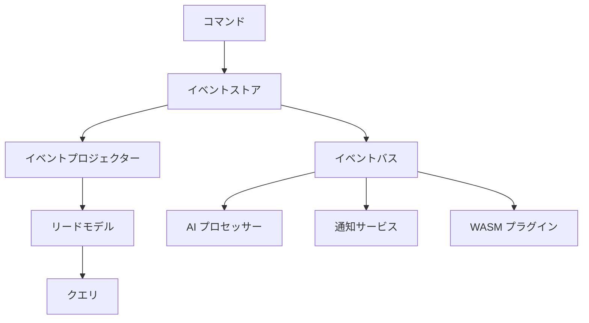

# Atomo Content Core

[English](README.md) · [简体中文](README.zh-CN.md) · [Español](README.es.md) · **日本語** · [Français](README.fr.md) · [Deutsch](README.de.md)

> **次世代 Content Core** — コンテンツ駆動型アプリ向けの、セルフホスト可能なイベントソース型バックエンド。TypeScript スキーマから、認証・リアルタイム・管理 UI を備えた GraphQL API を生成。セルフホスト型の **Firebase/Supabase 代替**。

[](https://github.com/atomo-cc/atomo/actions)
[](https://github.com/atomo-cc/atomo/releases)
[](https://opensource.org/licenses/MIT)

Atomo Content Core は、コンテンツ駆動型アプリ向けの、オープンソースでセルフホスト可能な**イベントソース型バックエンド**です。TypeScript の `schema.ts` でデータモデルを定義すると、**GraphQL API**、**認証 + RBAC**、**リアルタイム**、自動生成の**管理 UI** が手に入ります。**WASM/JS プラグイン**で拡張でき、**Docker** でデプロイ可能（Rust ツールチェーン不要）。自分の Postgres 上で動く、セルフホスト型の **Firebase/Supabase 代替**と考えてください。

## ✨ 主な特徴

- 🔄 **イベントソーシングアーキテクチャ**: 完全なデータ履歴追跡とタイムトラベル
- 🧠 **AI ネイティブ設計**: 組み込みの AI ワークフローとインテリジェントなコンテンツ処理
- 🎯 **フラッグシップアプリ駆動**: 実際の CRM アプリケーションがプラットフォームの進化を牽引
- 🔧 **デュアルモード定義**: TypeScript スキーマ + Rust コード生成
- 🚀 **高性能**: Rust バックエンド + モダンなフロントエンドスタック
- 🔌 **プラガブルアーキテクチャ**: 多言語拡張に対応した WASM プラグインシステム
- 🧩 **フォーク不要の拡張**: 宣言的なスキーマ制約（`@unique` / `@@check` / 部分インデックス）＋ プラグインが提供するカスタム HTTP ルート（`/ext/<plugin>`）
- 📊 **リアルタイムコラボレーション**: WebSocket 駆動のリアルタイムデータ同期

## 🚀 クイックスタート

### CLI のインストール

```bash
# Cargo でインストール
cargo install atomo_cli

# またはビルド済みバイナリをダウンロード
curl -L https://github.com/atomo-cc/atomo/releases/latest/download/atomo-linux-x86_64 -o atomo
chmod +x atomo
```

### 新しいプロジェクトの作成

```bash
# CRM アプリを作成
atomo init my-crm --template crm

# ブログアプリを作成
atomo init my-blog --template blog

# EC アプリを作成
atomo init my-shop --template ecommerce
```

### 開発とデプロイ

```bash
cd my-crm

# 開発サーバーを起動（サービスディレクトリ内）
atomo dev

# ワークスペースモード（リポジトリのルートまたは指定したサービス）
atomo dev --workspace [--service-path services/<name>]

# 本番ビルド
atomo build

# クラウドへデプロイ
atomo deploy
```

## フロントエンド

```bash
pnpm install

# Terminal 1: Admin UI
pnpm dev:admin

# Terminal 2: TypeScript SDK の watch/build ループ
pnpm --filter @atomo-cc/client-sdk dev

# CRM デモの信頼できる情報源
cd services/crm-service
pnpm generate
```

推奨される MVP ループ:
1. `services/crm-service/schema.ts` で CRM データモデルを調整します。
2. `pnpm --filter atomo-crm-service generate` を実行して CRM の生成物を更新します。
3. `pnpm --filter @atomo-cc/client-sdk build` を実行して SDK の型出力を検証します。
4. `pnpm dev:admin` で、Admin UI が生成された schema/metadata をどう消費するか確認します。

`packages/atomo-admin-ui` と `packages/atomo-client-sdk` はいずれも型チェックをグリーンに保つ必要があります。`pnpm --filter "./packages/*" test` でフロントエンド/SDK のベースラインを検証してください。

## 📁 プロジェクト構成

```
atomo/
├── crates/                    # Rust コアライブラリ
│   ├── atomo_core/           # 🔧 コアドメインモデルとイベント
│   ├── atomo_cli/            # 🖥️  コマンドラインツール
│   ├── atomo_server/         # 🌐 Web サーバー
│   ├── atomo_schema/         # 📝 スキーマパーサー
│   ├── atomo_projectors/     # 📊 イベントプロジェクター
│   └── atomo_realtime/       # 📡 一時的なリアルタイムチャネルとプレゼンス
├── packages/                  # フロントエンドパッケージ
│   ├── atomo-client-sdk/     # 📚 クライアント SDK
│   └── atomo-admin-ui/       # 🎛️  管理画面
│   └── atomo-crm-app/        # 💼 CRM フラッグシップアプリ
├── templates/                 # 📋 プロジェクトテンプレート
│   ├── crm/                  # CRM テンプレート
│   ├── blog/                 # ブログテンプレート
│   └── ecommerce/            # EC テンプレート
├── services/
│   └── crm-service/          # 💼 CRM デモサービス
└── docs/                      # 📄 ドキュメント
```

## 🏗️ アーキテクチャ

### イベントソーシング + CQRS



### 技術スタック

- **バックエンド**: Rust + Axum + async-graphql + PostgreSQL
- **フロントエンド**: TypeScript + React + Tailwind CSS
- **データ**: イベントソーシング + PostgreSQL + Redis
- **AI**: OpenAI API + ローカルモデルのサポート
- **デプロイ**: Docker + Kubernetes + GitHub Actions

## 🎯 ユースケース

### 1. エンタープライズ CRM

```typescript
// CRM スキーマを定義
export interface Contact {
  id: string;
  name: string;
  email: string;
  company?: Company;
  deals: Deal[];
}

export interface Company {
  id: string;
  name: string;
  size: CompanySize;
  industry: string;
}
```

### 2. コンテンツ管理システム

```typescript
// コンテンツスキーマを定義
export interface Article {
  id: string;
  title: string;
  content: string;
  author: User;
  tags: string[];
  publishedAt?: Date;
}
```

### 3. EC プラットフォーム

```typescript
// 商品スキーマを定義
export interface Product {
  id: string;
  name: string;
  price: number;
  inventory: number;
  categories: Category[];
}
```

## 🔧 開発ガイド

### ローカル開発環境

```bash
# 依存関係をインストール
git clone https://github.com/atomo-cc/atomo.git
cd atomo
cargo build
pnpm install

# 開発サーバーを起動
cargo run -p atomo_cli -- dev

# フロントエンド

git clone https://github.com/atomo-cc/atomo.git
cd atomo
pnpm install

# 現在推奨される開発エントリポイント
pnpm dev:admin
pnpm --filter @atomo-cc/client-sdk dev
pnpm --filter atomo-crm-service generate
```

### スキーマ駆動開発

1. **スキーマを定義**
   ```typescript
   // atomo/schema.ts
   export interface User {
     id: string;
     name: string;
     email: string;
   }
   ```

2. **コードを生成**
   ```bash
   atomo codegen
   ```

3. **生成されたコードを使用**
   ```rust
   use atomo_core::entities::User;

   async fn create_user(name: String, email: String) -> Result<User, Error> {
       // 自動生成された CRUD 操作
   }
   ```

詳細なロードマップと現在の進捗は docs/roadmap.md を、プラットフォームのビジョンとアーキテクチャは docs/vision.md を参照してください。

## 📊 パフォーマンス目標

| 指標 | 目標 |
|------|------|
| 同時リクエストのスループット | 10,000+ RPS |
| コールドスタート時間 | < 100ms |
| メモリ使用量 | < 50MB |
| イベント処理レイテンシ | < 10ms |

## 🗺️ ロードマップ

### フェーズ 1: 基盤 (✅ 完了)
- [x] モノレポのセットアップ
- [x] コアドメインモデル
- [x] CLI ツール (init, dev, migrate, codegen, test, deploy)
- [x] イベントソーシング基盤 (event_log, replay, エンティティ履歴)
- [x] スキーマパーサー (TypeScript → Rust/GraphQL)
- [x] 基本的な CRUD (動的 SQL, パラメータ化クエリ)
- [x] GraphQL サブスクリプション (WebSocket, モデルフィルタリング)
- [x] 認証/認可 (Argon2id, JWT, RBAC を GraphQL レイヤーで強制。データレイヤーの呼び出し元は未対応、OAuth2/OIDC)
- [x] 論理削除, ページネーション, リレーション解決
- [x] 入力検証, 構造化エラー
- [x] レート制限, リクエストトレーシング

### フェーズ 2: インテリジェンス強化 (大部分完了)
- [x] WASM プラグインシステム (サンドボックス, 権限, ライフサイクルフック) + JS スクリプトプラグイン (Javy)
- [x] フォーク不要の拡張: 宣言的なスキーマ制約（`@unique`/`@index`/`@@check`、`WHERE` 付き部分インデックスを含む）＋ プラグイン提供のカスタム HTTP ルート（`/ext/<plugin>`）
- [x] CQRS リードプロジェクション (イベント駆動のマテリアライズドビュー。削除/数値修正は B2 を参照)
- [x] リードキャッシュ (TTL + イベント無効化)
- [x] ファイルアップロード/ストレージ (`File` フィールド, multipart, コンテンツタイプ検証 + マジックバイトのスニッフィング, イベントソース化。ローカルバックエンド ✅, S3 バックエンドは `storage-s3` feature 後。docs/guide/advanced/upload-storage-plan 参照)
- [~] ワークフローエンジン (トリガー, 条件, リトライ, YAML ロード, HTTP ステップ。Mutation/Plugin ステップは未実装)
- [~] マルチテナント分離 (`tenant_id` カラム + 読み書き分離。サブスクリプションフィルタリング / ユーザー紐付け / PG RLS は未実装)
- [~] AI ワークフロー統合 (pgvector EmbeddingStore。エンドツーエンド未検証、pgvector 環境が必要)
- [~] ローカルファースト SDK (オフラインキュー, 再接続同期。統合テスト未実施)

> 各機能の実際の検証ステータスは CRM 適合性テストスイートに準拠します。docs/guide/advanced/crm-conformance-plan を参照してください。

### フェーズ 3: エコシステム (進行中)
- [x] OAuth2/OIDC SSO (Google, GitHub, Microsoft, Okta)
- [x] プロジェクトテンプレート (CRM, ブログ, EC)
- [x] ワークフローデザイナー (Admin UI エディタ: トリガー/ステップ/アクションフォーム + フロープレビュー)
- [ ] プラグインマーケットプレイス
- [ ] Atomo Cloud マネージドプラットフォーム

## 🤝 コントリビューション

コミュニティからの貢献を歓迎します！参加方法については [コントリビューションガイド](CONTRIBUTING.md) をご覧ください。

### クイックコントリビューション

1. プロジェクトをフォーク
2. 機能ブランチを作成: `git checkout -b feature/amazing-feature`
3. 変更をコミット: `git commit -m 'Add amazing feature'`
4. ブランチをプッシュ: `git push origin feature/amazing-feature`
5. プルリクエストを作成

## 📚 ドキュメント

- [ユーザーガイド](docs/user-guide.md)
- [API ドキュメント](docs/api.md)
- [デプロイガイド](docs/deployment.md)
- [プラグイン開発](docs/plugins.md)

## 💬 コミュニティ

- **GitHub Issues**: バグ報告と機能リクエスト
- **GitHub Discussions**: 技術的な議論と Q&A
- **Discord**: リアルタイムチャット (近日公開)

## 📄 ライセンス

本プロジェクトは [MIT ライセンス](LICENSE) の下でライセンスされています。

## 🙏 謝辞

すべてのコントリビューターと以下のオープンソースプロジェクトに感謝します:

- [Rust](https://rust-lang.org/) — システムプログラミング言語
- [Axum](https://github.com/tokio-rs/axum) — Web フレームワーク
- [async-graphql](https://github.com/async-graphql/async-graphql) — GraphQL サーバー
- [React](https://react.dev/) — フロントエンドフレームワーク

---

**コンテンツ管理をシンプルかつパワフルに！** 🚀

[使ってみる](https://github.com/atomo-cc/atomo/releases) | [ドキュメントを読む](docs/) | [コミュニティに参加](https://github.com/atomo-cc/atomo/discussions)
