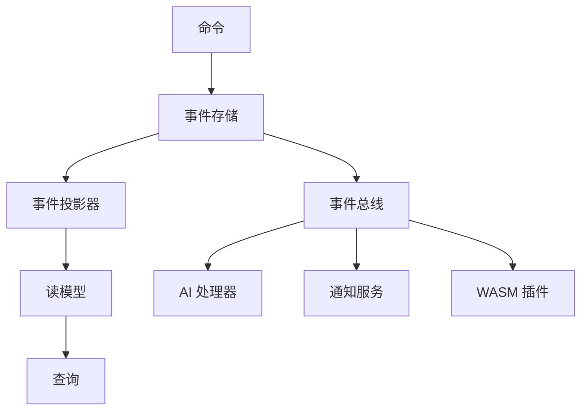

# Atomo Content Core

> 下一代内容管理平台 - 事件溯源架构 + AI 原生设计

[](https://github.com/your-org/atomo/actions)
[](https://github.com/your-org/atomo/releases)
[](https://opensource.org/licenses/MIT)

Atomo 是一个现代化的内容管理平台，基于事件溯源架构设计，原生支持 AI 集成，为企业级应用提供高性能、可扩展的内容管理解决方案。

## ✨ 核心特性

- 🔄 **事件溯源架构**: 完整的数据历史追踪和时间旅行
- 🧠 **AI 原生设计**: 内置 AI 工作流和智能内容处理
- 🎯 **旗舰应用驱动**: 通过 CRM 应用驱动平台演进
- 🔧 **双模式定义**: TypeScript Schema + Rust 代码生成
- 🚀 **高性能**: Rust 后端 + 现代前端技术栈
- 🔌 **插件化架构**: WASM 插件系统，支持多语言扩展
- 📊 **实时协作**: WebSocket 驱动的实时数据同步

## 🚀 快速开始

### 安装 CLI 工具

```bash
# 通过 Cargo 安装
cargo install atomo_cli

# 或下载预编译二进制文件
curl -L https://github.com/your-org/atomo/releases/latest/download/atomo-linux-x86_64 -o atomo
chmod +x atomo
```

### 创建新项目

```bash
# 创建 CRM 应用
atomo init my-crm --template crm

# 创建博客应用  
atomo init my-blog --template blog

# 创建电商应用
atomo init my-shop --template ecommerce
```

### 开发和部署

```bash
cd my-crm

# 启动开发服务器（服务目录中）
atomo dev

# 工作区模式（在仓库根或指定服务）
atomo dev --workspace [--service-path services/<name>]

# 构建生产版本
atomo build

# 部署到云端
atomo deploy
```

## 📁 项目结构

```
atomo/
├── crates/                    # Rust 核心库
│   ├── atomo_core/           # 🔧 核心域模型和事件
│   ├── atomo_cli/            # 🖥️  命令行工具
│   ├── atomo_server/         # 🌐 Web 服务器
│   ├── atomo_schema/         # 📝 Schema 解析器
│   ├── atomo_projectors/     # 📊 事件投影器
│   └── atomo_wasm_runtime/   # 🔌 WASM 插件运行时
├── packages/                  # 前端包
│   ├── atomo-client-sdk/     # 📚 客户端 SDK
│   ├── atomo-admin-ui/       # 🎛️  管理界面
│   └── atomo-crm-app/        # 💼 CRM 旗舰应用
├── templates/                 # 📋 项目模板
│   ├── crm/                  # CRM 模板
│   ├── blog/                 # 博客模板
│   └── ecommerce/            # 电商模板
└── docs/                      # � 文档
```

## 🏗️ 架构设计

### 事件溯源 + CQRS



### 技术栈

- **后端**: Rust + Axum + async-graphql + PostgreSQL
- **前端**: TypeScript + React/SvelteKit + Tailwind CSS
- **数据**: 事件溯源 + PostgreSQL + Redis
- **AI**: OpenAI API + 本地模型支持
- **部署**: Docker + Kubernetes + GitHub Actions

## 🎯 使用场景

### 1. 企业 CRM 系统

```typescript
// 定义 CRM Schema
export interface Contact {
  id: string;
  name: string;
  email: string;
  company?: Company;
  deals: Deal[];
}

export interface Company {
  id: string;
  name: string;
  size: CompanySize;
  industry: string;
}
```

### 2. 内容管理系统

```typescript
// 定义内容 Schema
export interface Article {
  id: string;
  title: string;
  content: string;
  author: User;
  tags: string[];
  publishedAt?: Date;
}
```

### 3. 电商平台

```typescript
// 定义产品 Schema
export interface Product {
  id: string;
  name: string;
  price: number;
  inventory: number;
  categories: Category[];
}
```

## 🔧 开发指南

### 本地开发环境

```bash
# 安装依赖
git clone https://github.com/your-org/atomo.git
cd atomo
cargo build
pnpm install

# 启动开发服务器
cargo run -p atomo_cli -- dev
```

### Schema 驱动开发

1. **定义 Schema**
   ```typescript
   // atomo/schema.ts
   export interface User {
     id: string;
     name: string;
     email: string;
   }
   ```

2. **生成代码**
   ```bash
   atomo codegen
   ```

3. **使用生成的代码**
   ```rust
   use atomo_core::entities::User;
   
   async fn create_user(name: String, email: String) -> Result<User, Error> {
       // 自动生成的 CRUD 操作
   }
   ```

### 插件开发

```rust
// WASM 插件示例
use atomo_wasm_runtime::*;

#[wasm_bindgen]
pub fn process_content(content: &str) -> String {
    // 自定义内容处理逻辑
    content.to_uppercase()
}
```

详细开发路线图和当前进度请参考 docs/roadmap.md；平台愿景与架构请参考 docs/vision.md。

## � 性能基准

| 指标 | 数值 |
|------|------|
| 并发请求处理 | 10,000+ RPS |
| 冷启动时间 | < 100ms |
| 内存占用 | < 50MB |
| 事件处理延迟 | < 10ms |

## 🗺️ 开发路线图

### Phase 1: 基础架构 (当前)
- [x] 单体仓库设置
- [x] 核心域模型
- [x] CLI 工具
- [x] 事件溯源基础
- [ ] Schema 解析器
- [ ] 基础 CRUD 操作

### Phase 2: 智能化升级
- [ ] AI 工作流集成
- [ ] 智能内容生成
- [ ] 自动化测试
- [ ] 性能优化

### Phase 3: 生态系统
- [ ] 插件市场
- [ ] 多租户支持
- [ ] 高级分析
- [ ] 企业级功能

## 🤝 贡献指南

我们欢迎社区贡献！请阅读我们的 [贡献指南](CONTRIBUTING.md) 了解如何参与。

### 快速贡献

1. Fork 项目
2. 创建功能分支: `git checkout -b feature/amazing-feature`
3. 提交更改: `git commit -m 'Add amazing feature'`
4. 推送分支: `git push origin feature/amazing-feature`
5. 创建 Pull Request

## � 文档

- [用户指南](docs/user-guide.md)
- [API 文档](docs/api.md)
- [部署指南](docs/deployment.md)
- [插件开发](docs/plugins.md)

## � 社区

- **GitHub Issues**: 报告问题和功能请求
- **GitHub Discussions**: 技术讨论和问答
- **Discord**: 实时聊天 (即将开放)

## 📄 许可证

本项目使用 [MIT 许可证](LICENSE)。

## 🙏 致谢

感谢所有贡献者和以下开源项目：

- [Rust](https://rust-lang.org/) - 系统编程语言
- [Axum](https://github.com/tokio-rs/axum) - Web 框架
- [async-graphql](https://github.com/async-graphql/async-graphql) - GraphQL 服务器
- [SvelteKit](https://kit.svelte.dev/) - 前端框架

---

**让内容管理变得简单而强大！** 🚀

[开始使用](https://github.com/your-org/atomo/releases) | [查看文档](docs/) | [加入社区](https://github.com/your-org/atomo/discussions)
