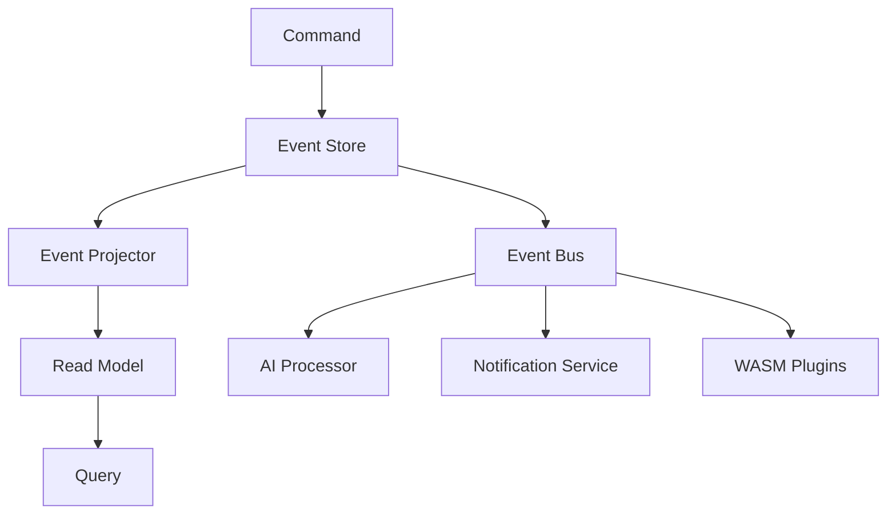

# Atomo Content Core

**English** · [简体中文](README.zh-CN.md) · [Español](README.es.md) · [日本語](README.ja.md) · [Français](README.fr.md) · [Deutsch](README.de.md)

> **Next-Generation Content Core** — a self-hostable, event-sourced backend for content-driven apps: a TypeScript schema becomes a GraphQL API with auth, realtime, and an admin UI. A self-hosted **Firebase/Supabase alternative**.

[](https://github.com/atomo-cc/atomo/actions)
[](https://github.com/atomo-cc/atomo/releases)
[](https://opensource.org/licenses/MIT)

Atomo Content Core is an open-source, self-hostable **event-sourced backend** for content-driven apps. Define your data model in a TypeScript `schema.ts` and Atomo gives you a **GraphQL API**, **authentication + RBAC**, **realtime**, and a generated **admin UI** — extensible with **WASM/JS plugins** and deployable with **Docker** (no Rust toolchain required). Think of it as a self-hosted **Firebase/Supabase alternative** that runs on your own Postgres.

## ✨ Core Features

- 🔄 **Event-Sourced Architecture**: Complete data-history tracking and time travel
- 🧠 **AI-Native Design**: Built-in AI workflows and intelligent content processing
- 🎯 **Flagship-App-Driven**: Platform evolution driven by a real CRM application
- 🔧 **Dual-Mode Definition**: TypeScript schema + Rust code generation
- 🪶 **Lean & honest**: a ~10 MB self-hostable binary — most apps are read-heavy, and Atomo serves hot reads from cache (~30× a bare query), with event sourcing, durable jobs, and a typed schema-driven backend built in, at a modest (Postgres-`fsync`-bound) write cost. See the [benchmarks](docs/guide/advanced/benchmarks.md) — including an honest co-located head-to-head vs `node-postgres`.
- 🔌 **Pluggable Architecture**: WASM plugin system with multi-language extension support
- 🧩 **Extend Without Forking**: declarable schema constraints (`@unique` / `@@check` / partial) + plugin-served custom HTTP routes (`/ext/<plugin>`)
- 📊 **Realtime Collaboration**: WebSocket-driven realtime data sync

## 📍 Status

Atomo is **pre-1.0 but real** — the published Docker image runs a working backend.

- **Solid today:** schema-driven **GraphQL API** (CRUD, relations, pagination,
  filtering), **auth** (Argon2id, JWT, RBAC, OAuth/OIDC), **event-sourced** writes +
  audit, **declarable schema constraints**, **plugin-served custom HTTP routes** (incl.
  atomic transactional routes), **WASM/JS plugins**, **realtime channels**, **file
  storage**, and a generated **admin UI** — all self-hostable via Docker.
- **Solid today (cont.):** opt-in **multi-tenant Row-Level Security** (`ATOMO_ENABLE_RLS`) —
  DB-enforced tenant isolation as defense-in-depth on top of the app-layer `tenant_id` scoping.
- **Early / in progress:** AI + pgvector workflows (needs a pgvector env), some admin
  panels (observability, collaboration — scaffolded, not yet wired), the **multi-project
  control plane** (`atomo_control_plane` — foundations + `atomo project` CLI; not yet a runnable
  service), and the local-first SDK. See the [roadmap](docs/roadmap.md).

Pin a version (e.g. `ghcr.io/atomo-cc/atomo-server:v0.4.0`) rather than `:latest` for
reproducibility.

## 🚀 Quick Start

### Run it with no Rust (Docker) — ~5 minutes

Scaffold a project and run it against the published image — no toolchain required:

```bash
npm create @atomo-cc/app my-app   # writes atomo/schema.ts + docker-compose.yml
cd my-app
docker compose up                 # pulls the atomo-server image and boots
```

- **GraphQL API** → http://localhost:3000/graphql
- **Admin UI** → http://localhost:3000/admin (sign in with the seeded admin)
- **Health** → http://localhost:3000/health

Edit `atomo/schema.ts` (add a model, a field, a `// @@check(...)` constraint) and the
server re-migrates on restart — edit-and-live in ~2s, still no Rust.
Templates: `npm create @atomo-cc/app my-app -- --template crm|blog|ecommerce`.

### Or use the CLI (Rust) — for local dev with hot reload

```bash
cargo install atomo_cli
atomo init my-crm --template crm
cd my-crm && atomo dev
```

## Frontend

```bash
pnpm install

# Terminal 1: Admin UI
pnpm dev:admin

# Terminal 2: TypeScript SDK watch/build loop
pnpm --filter @atomo-cc/client-sdk dev

# CRM demo source of truth
cd services/crm-service
pnpm generate
```

Recommended MVP loop:
1. Adjust the CRM data model in `services/crm-service/schema.ts`.
2. Run `pnpm --filter atomo-crm-service generate` to refresh the CRM generated output.
3. Run `pnpm --filter @atomo-cc/client-sdk build` to verify the SDK's type output.
4. Use `pnpm dev:admin` to check how the Admin UI consumes the generated schema/metadata.

Both `packages/atomo-admin-ui` and `packages/atomo-client-sdk` should keep type-checking green; verify the frontend/SDK baseline with `pnpm --filter "./packages/*" test`.

## 📁 Project Structure

```
atomo/
├── crates/                    # Rust core libraries
│   ├── atomo_core/           # 🔧 Core domain models and events
│   ├── atomo_cli/            # 🖥️  Command-line tool
│   ├── atomo_server/         # 🌐 Web server
│   ├── atomo_schema/         # 📝 Schema parser
│   ├── atomo_projectors/     # 📊 Event projectors
│   ├── atomo_realtime/       # 📡 Ephemeral realtime channels and presence
│   └── atomo_control_plane/  # 🛰️  Multi-project control plane (registry, provisioner, gateway)
├── packages/                  # Frontend packages
│   ├── atomo-client-sdk/     # 📚 Client SDK
│   └── atomo-admin-ui/       # 🎛️  Admin interface
│   └── atomo-crm-app/        # 💼 CRM flagship app
├── templates/                 # 📋 Project templates
│   ├── crm/                  # CRM template
│   ├── blog/                 # Blog template
│   └── ecommerce/            # E-commerce template
├── services/
│   └── crm-service/          # 💼 CRM demo service
└── docs/                      # 📄 Documentation
```

## 🏗️ Architecture

### Event Sourcing + CQRS



### Tech Stack

- **Backend**: Rust + Axum + async-graphql + PostgreSQL
- **Frontend**: TypeScript + React + Tailwind CSS
- **Data**: Event sourcing + PostgreSQL + Redis
- **AI**: OpenAI API + local model support
- **Deployment**: Docker + Kubernetes + GitHub Actions

## 🎯 Use Cases

### 1. Enterprise CRM

```typescript
// Define the CRM schema
export interface Contact {
  id: string;
  name: string;
  email: string;
  company?: Company;
  deals: Deal[];
}

export interface Company {
  id: string;
  name: string;
  size: CompanySize;
  industry: string;
}
```

### 2. Content Management System

```typescript
// Define the content schema
export interface Article {
  id: string;
  title: string;
  content: string;
  author: User;
  tags: string[];
  publishedAt?: Date;
}
```

### 3. E-commerce Platform

```typescript
// Define the product schema
export interface Product {
  id: string;
  name: string;
  price: number;
  inventory: number;
  categories: Category[];
}
```

## 🔧 Development Guide

### Local development environment

```bash
# Install dependencies
git clone https://github.com/atomo-cc/atomo.git
cd atomo
cargo build
pnpm install

# Start the dev server
cargo run -p atomo_cli -- dev

# Frontend

git clone https://github.com/atomo-cc/atomo.git
cd atomo
pnpm install

# Current recommended dev entry points
pnpm dev:admin
pnpm --filter @atomo-cc/client-sdk dev
pnpm --filter atomo-crm-service generate
```

### Schema-driven development

1. **Define the schema**
   ```typescript
   // atomo/schema.ts
   export interface User {
     id: string;
     name: string;
     email: string;
   }
   ```

2. **Generate code**
   ```bash
   atomo codegen
   ```

3. **Use the generated code**
   ```rust
   use atomo_core::entities::User;

   async fn create_user(name: String, email: String) -> Result<User, Error> {
       // Auto-generated CRUD operations
   }
   ```

For the detailed roadmap and current progress see docs/roadmap.md; for the platform vision and architecture see docs/vision.md.

## 📊 Performance Targets

| Metric | Target |
|------|------|
| Concurrent request throughput | 10,000+ RPS |
| Cold-start time | < 100ms |
| Memory footprint | < 50MB |
| Event-processing latency | < 10ms |

## 🗺️ Roadmap

### Phase 1: Foundation (✅ Done)
- [x] Monorepo setup
- [x] Core domain models
- [x] CLI tooling (init, dev, migrate, codegen, test, deploy)
- [x] Event-sourcing foundation (event_log, replay, entity history)
- [x] Schema parser (TypeScript → Rust/GraphQL)
- [x] Basic CRUD (dynamic SQL, parameterized queries)
- [x] GraphQL subscriptions (WebSocket, model filtering)
- [x] AuthN/AuthZ (Argon2id, JWT, RBAC enforced at the GraphQL layer; data-layer callers TBD, OAuth2/OIDC)
- [x] Soft delete, pagination, relation resolution
- [x] Input validation, structured errors
- [x] Rate limiting, request tracing

### Phase 2: Intelligence Upgrade (mostly done)
- [x] WASM plugin system (sandbox, permissions, lifecycle hooks) + JS script plugins (Javy)
- [x] Extend-without-forking seams: declarable schema constraints (`@unique`/`@index`/`@@check`, incl. partial `WHERE`) + plugin-served custom HTTP routes (`/ext/<plugin>`)
- [x] CQRS read projections (event-driven materialized views; deletes/numeric corrections see B2)
- [x] Read cache (TTL + event invalidation)
- [x] File upload/storage (`File` field, multipart, content-type validation + magic-byte sniffing, event-sourced; local backend ✅, S3 backend behind the `storage-s3` feature; see docs/guide/advanced/upload-storage-plan)
- [~] Workflow engine (triggers, conditions, retries, YAML loading, HTTP steps; Mutation/Plugin steps TBD)
- [~] Multi-tenant isolation (`tenant_id` column + read/write isolation; subscription filtering / user binding / PG RLS TBD)
- [~] AI workflow integration (pgvector EmbeddingStore; not yet end-to-end verified, needs a pgvector environment)
- [~] Local-first SDK (offline queue, reconnect sync; not yet integration-tested)

> The real verification status of each capability is governed by the CRM conformance test suite; see docs/guide/advanced/crm-conformance-plan.

### Phase 3: Ecosystem (in progress)
- [x] OAuth2/OIDC SSO (Google, GitHub, Microsoft, Okta)
- [x] Project templates (CRM, blog, e-commerce)
- [x] Workflow designer (Admin UI editor: trigger/step/action forms + flow preview)
- [ ] Plugin marketplace
- [ ] Atomo Cloud hosted platform

## 🤝 Contributing

We welcome community contributions! Please read our [Contributing Guide](CONTRIBUTING.md) to learn how to get involved.

### Quick contribution

1. Fork the project
2. Create a feature branch: `git checkout -b feature/amazing-feature`
3. Commit your changes: `git commit -m 'Add amazing feature'`
4. Push the branch: `git push origin feature/amazing-feature`
5. Open a Pull Request

## 📚 Documentation

- [User Guide](docs/user-guide.md)
- [API Docs](docs/api.md)
- [Deployment Guide](docs/deployment.md)
- [Plugin Development](docs/plugins.md)

## 💬 Community

- **GitHub Issues**: Report bugs and feature requests
- **GitHub Discussions**: Technical discussion and Q&A
- **Discord**: Realtime chat (coming soon)

## 📄 License

This project is licensed under the [MIT License](LICENSE).

## 🙏 Acknowledgements

Thanks to all contributors and the following open-source projects:

- [Rust](https://rust-lang.org/) — systems programming language
- [Axum](https://github.com/tokio-rs/axum) — web framework
- [async-graphql](https://github.com/async-graphql/async-graphql) — GraphQL server
- [React](https://react.dev/) — frontend framework

---

**Make content management simple and powerful!** 🚀

[Get Started](https://github.com/atomo-cc/atomo/releases) | [Read the Docs](docs/) | [Join the Community](https://github.com/atomo-cc/atomo/discussions)
