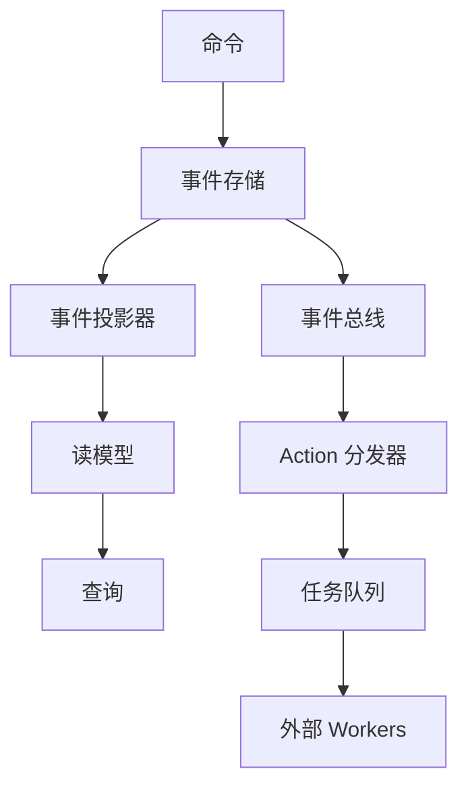

# Atomo Content Core

[English](README.md) · **简体中文** · [Español](README.es.md) · [日本語](README.ja.md) · [Français](README.fr.md) · [Deutsch](README.de.md)

> **下一代 Content Core** —— 面向内容型应用、可自托管的事件溯源后端：用 TypeScript schema 即可生成带认证、实时与管理后台的 GraphQL API。一个可自托管的 **Firebase/Supabase 替代方案**。

[](https://github.com/atomo-cc/atomo/actions)
[](https://github.com/atomo-cc/atomo/releases)
[](https://opensource.org/licenses/MIT)

Atomo Content Core 是一个开源、可自托管、面向内容型应用的**事件溯源后端**。在 TypeScript `schema.ts` 中定义数据模型，Atomo 即为你生成 **GraphQL API**、**认证与 RBAC**、**实时通道**以及自动生成的**管理后台**——可通过 **actions 和外部 workers** 扩展，并用 **Docker** 部署（无需 Rust 工具链）。可以把它看作运行在你自己的 Postgres 上、可自托管的 **Firebase/Supabase 替代方案**。

## ✨ 核心特性

- 🔄 **事件溯源架构**: 完整的数据历史追踪和时间旅行
- 🧠 **AI 原生设计**: 内置 AI 工作流和智能内容处理
- 🎯 **旗舰应用驱动**: 通过 CRM 应用驱动平台演进
- 🔧 **双模式定义**: TypeScript Schema + Rust 代码生成
- 🚀 **高性能**: Rust 后端 + 现代前端技术栈
- 🔌 **Actions & Workers**: 在 schema 中声明生命周期 actions（`on.created`、`on.updated`）并支持条件——Atomo 自动将持久化任务分发给外部 TypeScript workers
- 🧩 **无需 fork 的扩展**: 可声明的 schema 约束（`@unique` / `@@check` / 部分索引）+ 直接 action API（`POST /api/actions/:name`）
- 📊 **实时协作**: WebSocket 驱动的实时数据同步

## 🚀 快速开始

### 安装 CLI 工具

```bash
# 通过 Cargo 安装
cargo install atomo_cli

# 或下载预编译二进制文件
curl -L https://github.com/atomo-cc/atomo/releases/latest/download/atomo-linux-x86_64 -o atomo
chmod +x atomo
```

### 创建新项目

```bash
# 创建 CRM 应用
atomo init my-crm --template crm

# 创建博客应用
atomo init my-blog --template blog

# 创建电商应用
atomo init my-shop --template ecommerce
```

### 开发和部署

```bash
cd my-crm

# 启动开发服务器（服务目录中）
atomo dev

# 工作区模式（在仓库根或指定服务）
atomo dev --workspace [--service-path services/<name>]

# 构建生产版本
atomo build

# 部署到云端
atomo deploy
```

## 前端

```bash
pnpm install

# Terminal 1: Admin UI
pnpm dev:admin

# Terminal 2: TypeScript SDK watch/build loop
pnpm --filter @atomo-cc/client-sdk dev

# CRM demo source of truth
cd services/crm-service
pnpm generate
```

推荐 MVP 循环：
1. 在 `services/crm-service/schema.ts` 调整 CRM 数据模型。
2. 运行 `pnpm --filter atomo-crm-service generate` 更新 CRM 生成物。
3. 运行 `pnpm --filter @atomo-cc/client-sdk build` 验证 SDK 类型输出。
4. 用 `pnpm dev:admin` 检查 Admin UI 对生成 schema/metadata 的消费。

`packages/atomo-admin-ui` 和 `packages/atomo-client-sdk` 都应保持 type-check 通过；用 `pnpm --filter "./packages/*" test` 验证前端/SDK 基线。

## 📁 项目结构

```
atomo/
├── crates/                    # Rust 核心库
│   ├── atomo_core/           # 🔧 核心域模型和事件
│   ├── atomo_cli/            # 🖥️  命令行工具
│   ├── atomo_server/         # 🌐 Web 服务器
│   ├── atomo_schema/         # 📝 Schema 解析器
│   ├── atomo_projectors/     # 📊 事件投影器
│   └── atomo_realtime/       # 📡 临时实时通道与在线状态
├── packages/                  # 前端包
│   ├── atomo-client-sdk/     # 📚 客户端 SDK
│   └── atomo-admin-ui/       # 🎛️  管理界面
│   └── atomo-crm-app/        # 💼 CRM 旗舰应用
├── templates/                 # 📋 项目模板
│   ├── crm/                  # CRM 模板
│   ├── blog/                 # 博客模板
│   └── ecommerce/            # 电商模板
├── services/
│   └── crm-service/          # 💼 CRM demo 服务
└── docs/                      # 📄 文档
```

## 🏗️ 架构设计

### 事件溯源 + CQRS



### 技术栈

- **后端**: Rust + Axum + async-graphql + PostgreSQL
- **前端**: TypeScript + React + Tailwind CSS
- **数据**: 事件溯源 + PostgreSQL + Redis
- **AI**: OpenAI API + 本地模型支持
- **部署**: Docker + Kubernetes + GitHub Actions

## 🎯 使用场景

### 1. 企业 CRM 系统

```typescript
// 定义 CRM Schema
export interface Contact {
  id: string;
  name: string;
  email: string;
  company?: Company;
  deals: Deal[];
}

export interface Company {
  id: string;
  name: string;
  size: CompanySize;
  industry: string;
}
```

### 2. 内容管理系统

```typescript
// 定义内容 Schema
export interface Article {
  id: string;
  title: string;
  content: string;
  author: User;
  tags: string[];
  publishedAt?: Date;
}
```

### 3. 电商平台

```typescript
// 定义产品 Schema
export interface Product {
  id: string;
  name: string;
  price: number;
  inventory: number;
  categories: Category[];
}
```

## 🔧 开发指南

### 本地开发环境

```bash
# 安装依赖
git clone https://github.com/atomo-cc/atomo.git
cd atomo
cargo build
pnpm install

# 启动开发服务器
cargo run -p atomo_cli -- dev

# 前端

git clone https://github.com/atomo-cc/atomo.git
cd atomo
pnpm install

# 当前推荐开发入口
pnpm dev:admin
pnpm --filter @atomo-cc/client-sdk dev
pnpm --filter atomo-crm-service generate
```

### Schema 驱动开发

1. **定义 Schema**
   ```typescript
   // atomo/schema.ts
   export interface User {
     id: string;
     name: string;
     email: string;
   }
   ```

2. **生成代码**
   ```bash
   atomo codegen
   ```

3. **使用生成的代码**
   ```rust
   use atomo_core::entities::User;

   async fn create_user(name: String, email: String) -> Result<User, Error> {
       // 自动生成的 CRUD 操作
   }
   ```

详细开发路线图和当前进度请参考 docs/roadmap.md；平台愿景与架构请参考 docs/vision.md。

## 📊 性能目标

| 指标 | 目标 |
|------|------|
| 并发请求处理 | 10,000+ RPS |
| 冷启动时间 | < 100ms |
| 内存占用 | < 50MB |
| 事件处理延迟 | < 10ms |

## 🗺️ 开发路线图

### Phase 1: 基础架构 (✅ 完成)
- [x] 单体仓库设置
- [x] 核心域模型
- [x] CLI 工具 (init, dev, migrate, codegen, test, deploy)
- [x] 事件溯源基础 (event_log, replay, entity history)
- [x] Schema 解析器 (TypeScript → Rust/GraphQL)
- [x] 基础 CRUD 操作 (动态 SQL, 参数化查询)
- [x] GraphQL 订阅 (WebSocket, 模型过滤)
- [x] 认证授权 (Argon2id, JWT, RBAC 在 GraphQL 层强制；数据层调用方待补, OAuth2/OIDC)
- [x] 软删除, 分页, 关系解析
- [x] 输入验证, 结构化错误
- [x] 速率限制, 请求追踪

### Phase 2: 智能化升级 (大部分完成)
- [x] Actions & workers: 生命周期事件绑定（`ModelEvents`）、action 分发器、直接 action API、Worker SDK（`@atomo-cc/worker-sdk`）
- [x] 无需 fork 的扩展能力：可声明的 schema 约束（`@unique`/`@index`/`@@check`，含带 `WHERE` 的部分索引）
- [x] CQRS 读投影 (事件驱动物化视图；删除/数值修正见 B2)
- [x] 读缓存 (TTL + 事件失效)
- [x] 文件上传/存储 (`File` 字段, multipart, 内容类型校验+魔术字节嗅探, 事件溯源; 本地后端✅, S3 后端在 `storage-s3` feature 后; 详见 docs/guide/advanced/upload-storage-plan)
- [~] 工作流引擎 (触发器, 条件, 重试, YAML 加载, HTTP 步骤；Mutation/Plugin 步骤待实现)
- [~] 多租户隔离 (`tenant_id` 列 + 读写隔离；订阅过滤/用户绑定/PG RLS 待实现)
- [~] AI 工作流集成 (pgvector EmbeddingStore；尚未端到端验证，需 pgvector 环境)
- [~] 本地优先 SDK (离线队列, 重连同步；尚未集成测试)

> 各能力的真实验证状态以 CRM 一致性测试套件为准，详见 docs/guide/advanced/crm-conformance-plan。

### Phase 3: 生态系统 (进行中)
- [x] OAuth2/OIDC SSO (Google, GitHub, Microsoft, Okta)
- [x] 项目模板 (CRM, 博客, 电商)
- [x] 工作流设计器 (Admin UI 编辑器：触发器/步骤/动作表单 + 流程预览)
- [ ] 插件市场
- [ ] Atomo Cloud 托管平台

## 🤝 贡献指南

我们欢迎社区贡献！请阅读我们的 [贡献指南](CONTRIBUTING.md) 了解如何参与。

### 快速贡献

1. Fork 项目
2. 创建功能分支: `git checkout -b feature/amazing-feature`
3. 提交更改: `git commit -m 'Add amazing feature'`
4. 推送分支: `git push origin feature/amazing-feature`
5. 创建 Pull Request

## 📚 文档

- [用户指南](docs/user-guide.md)
- [API 文档](docs/api.md)
- [部署指南](docs/deployment.md)
- [插件开发](docs/plugins.md)

## 💬 社区

- **GitHub Issues**: 报告问题和功能请求
- **GitHub Discussions**: 技术讨论和问答
- **Discord**: 实时聊天 (即将开放)

## 📄 许可证

本项目使用 [MIT 许可证](LICENSE)。

## 🙏 致谢

感谢所有贡献者和以下开源项目：

- [Rust](https://rust-lang.org/) - 系统编程语言
- [Axum](https://github.com/tokio-rs/axum) - Web 框架
- [async-graphql](https://github.com/async-graphql/async-graphql) - GraphQL 服务器
- [React](https://react.dev/) - 前端框架

---

**让内容管理变得简单而强大！** 🚀

[开始使用](https://github.com/atomo-cc/atomo/releases) | [查看文档](docs/) | [加入社区](https://github.com/atomo-cc/atomo/discussions)
