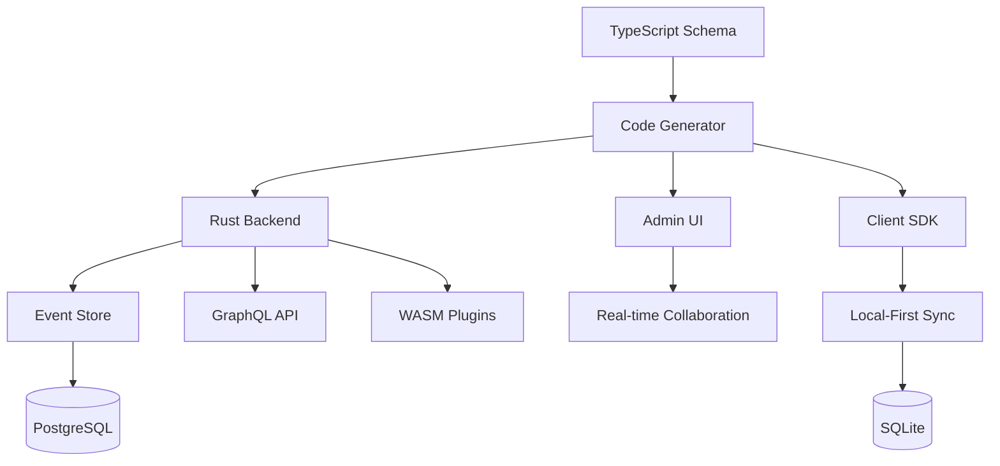

# Introduction to Atomo

Atomo is a revolutionary platform that transforms how you build modern applications. It's not just another CMS - it's a **Content Core** that serves as the "Arc Reactor" powering your entire application ecosystem.

## The Problem with Traditional Development

Building modern applications today involves countless repetitive tasks:

- 🔄 Writing boilerplate CRUD operations
- 🗄️ Managing database schemas and migrations  
- 🌐 Creating and maintaining APIs
- 🎨 Building admin interfaces
- 📱 Handling real-time updates
- 🔄 Implementing offline sync
- 🤝 Adding collaboration features

**What if you could eliminate 90% of this work?**

## The Atomo Solution

Atomo introduces a **schema-driven development** paradigm where you:

1. **Define** your data model in TypeScript
2. **Generate** a complete Rust backend automatically
3. **Develop** with instant hot reload and type safety
4. **Deploy** with built-in scalability and reliability

### Core Philosophy: Three Pillars

> **Status note:** *Declarative Development* is shipped and is what the platform does today.
> *Local-First* and *Real-time Collaboration* are the product vision and are on the
> [roadmap](/roadmap) — not yet implemented. They're described below as direction, not current
> features.

#### 🏠 **Local-First** *(planned)*
Your application's "source of truth" lives on the user's device. This provides:
- **Instant responsiveness** - no network delays
- **Offline capability** - works anywhere, anytime  
- **Data sovereignty** - users control their data
- **Resilience** - immune to server outages

#### 🤝 **Real-time Collaboration** *(planned)*
Multi-user experiences are a first-class citizen, not an afterthought:
- **Conflict-free merging** with CRDTs
- **Figma-like collaboration** out of the box
- **Live cursors and selections** 
- **Granular permissions** and access control

#### 📝 **Declarative Development** *(shipped)*
Focus on business logic, not infrastructure:
- **TypeScript schemas** generate everything
- **Zero boilerplate** CRUD operations
- **Automatic API generation** with GraphQL
- **Type-safe** end-to-end development

## Key Metaphors

### 🔋 "Arc Reactor" - The Heart of Iron Man
Atomo isn't just storage - it's the energy core that powers your entire system:
- **Extreme reliability** with Rust's memory safety
- **Unmatched performance** with zero-cost abstractions
- **Audit capabilities** with complete event history
- **Self-healing** with automatic recovery

### 🌊 "River of Events" - Event Sourcing
In Atomo's world, data isn't static snapshots but a flowing river of events:
- **Immutable history** - every change is preserved
- **Time travel** - replay any point in time
- **Perfect audit trails** - know exactly what happened when
- **Business certainty** - deterministic state reconstruction

### 🎨 "Flowing Canvas" - Content Creation
Break free from rigid forms with Notion-like content editing:
- **Block-based composition** - mix text, media, data
- **AI-powered assistance** - intelligent content suggestions
- **Plugin extensibility** - custom blocks via WASM
- **Collaborative editing** - real-time co-creation

## Architecture Overview

### The Magic: Instant Compilation

Atomo's development workflow is unlike anything else:

1. **Edit** `schema.ts` - define your data model
2. **Save** - Atomo detects changes instantly
3. **Generate** - specialized Rust code created
4. **Compile** - incremental compilation (seconds, not minutes)
5. **Reload** - browser refreshes with new features

This gives you **Rust performance** with **TypeScript productivity**.

## What Makes Atomo Different?

| Traditional Stack | Atomo |
|------------------|-------|
| Write CRUD by hand | Generated automatically |
| Manage API endpoints | GraphQL schema from types |
| Build admin UI | Dynamic UI from schema |
| Handle real-time manually | Built-in subscriptions |
| Wire up auth/RBAC by hand | Enforced from schema access rules |
| Add collaboration later | *Planned (CRDT) — see roadmap* |
| Implement offline sync | *Planned (local-first) — see roadmap* |
| Deploy complex infrastructure | Single binary deployment |

## Use Cases

Atomo excels at building:

### 🏢 **Business Applications**
- CRM and sales systems
- Project management tools  
- HR and employee portals
- Financial dashboards

### 📝 **Content Platforms**
- Collaborative documentation
- Knowledge management systems
- Publishing platforms
- Learning management systems

### 🛒 **E-commerce Solutions**
- Product catalogs
- Order management
- Customer portals
- Inventory systems

### 🎯 **Specialized Tools**
- Real-time analytics dashboards
- Workflow automation platforms
- API-first headless systems
- Multi-tenant SaaS applications

## Getting Started

Ready to experience the future of application development?

**Quick Start**: Boot a CRM-backed GraphQL service locally with the [Getting Started Guide](/guide/getting-started).

Or explore these key concepts:

- **[Event Sourcing](/guide/event-sourcing)** - Understanding the "River of Events"
- **[Schema-Driven Development](/guide/schema-driven)** - From TypeScript to Production
- **[Real-time Collaboration](/guide/collaboration)** - *Planned* — building Figma-like experiences
- **[Local-First Architecture](/guide/local-first)** - *Planned* — offline-capable applications

## Community & Support

- 📖 **[GitHub](https://github.com/atomo-cc/atomo)** - Source code and issues
- 💬 **[GitHub Discussions](https://github.com/atomo-cc/atomo/discussions)** - Questions and discussion

---

**Welcome to Atomo - where content becomes the core of everything you build.** 🚀