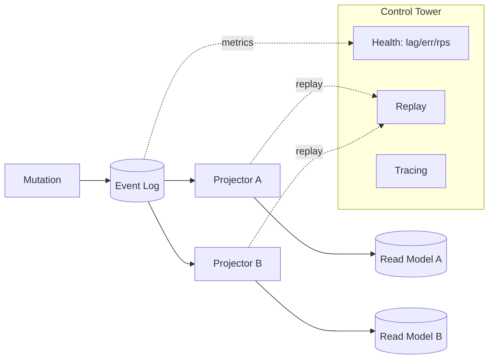

# Vision & Architecture

Atomo is a next‑generation Content Core (cc) — not a passive CMS “warehouse”, but the arc reactor that powers your business. Atomo treats content as living events, composes experiences from strongly‑typed blocks, and exposes an extensible energy hub (WASM‑ready) for automation and integration. It is built on Rust for performance, safety, and operational certainty, and it is driven by schemas to turn declarations into running systems.

- Content Core, not CMS: from content storage to business driver.
- Rust foundation: high throughput, low latency, memory safety.
- Schema‑driven: declare once; generate backend, GraphQL, Admin UI, and SDK types.

Quick Nav
- Core Metaphors (#core-metaphors)
- Guiding Philosophy (#guiding-philosophy)
- Architecture Overview (#architecture-overview)
  - Core Runtime: ES + CQRS (#core-runtime-event-sourcing--cqrs)
  - Dev Runtime (Instant Compile) (#instantly-compiled-service-runtime-dev-mode)
  - TypeScript DSLs (#typescript-dsls)
  - GraphQL and Admin UI (#graphql-and-admin-ui)
  - SDKs and Local‑First (#sdks-and-local-first-runtime)
  - Hydra UI (#hydra-ui-design)
  - Extensibility and Plugins (#extensibility-and-plugins)
- Security & Permissions (#security-auth-and-permissions)
- Control Tower (#operations--observability-control-tower)
- Developer Experience (#developer-experience-dx)
- Strategy Snapshot (#strategy-snapshot)
- Roadmap Link (#relationship-to-roadmap)

## Core Metaphors

- Arc Reactor: the reliable, high‑performance core (Rust + event sourcing) that powers the platform.
- River of Events: state changes are immutable events, enabling audit, time travel, and resilient read models.
- Flowing Canvas: Notion‑like, strongly‑typed blocks allow freeform composition beyond rigid forms.
- Energy Hub: a standardized, permissioned extension surface (WASM design) for business logic and integrations.

## Guiding Philosophy

- Local‑First: the source of truth near the user for resilient UX; the cloud coordinates sync/collaboration.
- Real‑Time Collaboration: CRDTs and subscriptions for fine‑grained, multi‑user experiences.
- Declarative Development: TypeScript DSLs for models, access, hooks, and workflows; the toolchain generates and composes performant services.

## Architecture Overview

### Monorepo and Modules

- `crates/`: Rust workspace — `atomo_core`, `atomo_server`, `atomo_cli`, schema/codegen tools, WASM runtime scaffolding.
- `packages/`: Admin UI and TypeScript SDK.
- `services/`: service instances (e.g., CRM) with `schema.ts`, plugins, workflows, and generated artifacts.
- `docs/`: VitePress documentation; `tests/` and `migrations/` shared assets.

### Core Runtime: Event Sourcing + CQRS

- All mutations append immutable events to an event log; read models are derived via projections.
- Guarantees: complete audit trail, historical queries, and deterministic recovery (replay from log).
- Platform schema (users, sessions, audit) merges with service schema into a unified GraphQL API.

Event model primer
- Event streams: per‑aggregate or contextual streams with ordered events.
- Projections: idempotent processors that build tables, indexes, or caches for queries.
- Time‑travel: query historical state by replaying to checkpoints.
- Audit: a privileged projection and API that exposes change history across domains.

Deepening
- Event versioning and upcasting: when schemas evolve, old events are adapted in memory by upcasters to the latest shape; upcasters co‑locate with event types and follow explicit versioning.
- Projector checkpoints and idempotency: each projector keeps its own checkpoint table (projector name, stream, offset/timestamp); idempotent handlers ensure duplicates do not corrupt read models; safe replay from any checkpoint.
- Transaction boundaries: command validation and event append occur atomically; external side effects (notifications, search) are handled by projectors/jobs for isolation; reads are eventually consistent.

### Instantly‑Compiled Service Runtime (Dev Mode)

When you run `atomo dev` (per service or in workspace mode), Atomo builds a tailored Rust binary for that service:

1) Parse service schema: read `services/<name>/schema.ts` (and platform modules).
2) Generate Rust: models, GraphQL resolvers, access hooks, metadata endpoints.
3) Assemble runtime: create a temporary workspace at `.atomo/runtime` with a standard `Cargo.toml` and `src/main.rs` that embed the generated code.
4) Compile: use Cargo incremental compilation for fast rebuilds.
5) Hot reload: file watchers trigger codegen and a fast process restart (TS and Rust changes).
6) Dev conveniences: GraphQL IDE (`/graphql`), schema metadata (`/meta/schema`), dev endpoints (`GET /schema.ts`). In workspace mode, proxy Admin UI under `/admin`.

Endpoints and paths
- Source schema: `services/<name>/schema.ts`
- Generated workspace: `services/<name>/.atomo/runtime/`
- GraphQL IDE: `/graphql` (service) or `/playground` (workspace)
- Metadata API: `/meta/schema` (JSON), `GET /schema.ts` (dev)
- Admin UI proxy: `/admin` (workspace mode)

Dev pipeline (Mermaid)
```mermaid
graph TD
  A[schema.ts] -->|codegen| B[Generated Rust]
  B --> C[.atomo/runtime]
  C -->|cargo build| D[Service Binary]
  D --> E[/graphql & /meta/schema]
  D --> F[/admin proxy]
```

### TypeScript DSLs

- Schema DSL (`schema.ts`)
  - Entities, relations, unions/blocks, validation.
  - Access Control (RBAC/ABAC‑style) and lifecycle hooks.
  - Strongly‑typed composable content (blocks) for Flowing Canvas.

- Workflow DSL
  - Typesafe orchestration for long‑running, async, cross‑service workflows.
  - Code, not YAML; supports retries, sagas, and compensation patterns.

- Design Tokens
  - Platform‑agnostic style primitives that compile to CSS variables, Tailwind, Swift enums, and Android resources for consistent branding.

Example sketch

```ts
// services/crm-service/schema.ts (illustrative)
export type Role = 'Admin' | 'Manager' | 'Sales' | 'Support' | 'Viewer'

export interface Company { id: string; name: string; industry?: string }

export interface Contact {
  id: string
  name: string
  email?: string
  company?: Company
  notes: Block[]
}

export type Block =
  | { type: 'Paragraph'; text: string }
  | { type: 'CallLog'; at: Date; summary: string }

export const access = {
  Contact: {
    read: ({ role }: { role: Role }) => role !== 'Viewer' ? ['id','name'] : ['id','name','email','company'],
    update: ({ role }: { role: Role }) => role === 'Admin' || role === 'Manager'
  }
}
```

Workflow DSL (sketch)
```ts
// Order flow: compensate on failed fulfillment
export const workflow = defineWorkflow('OrderFlow')
  .step('charge', async (ctx) => {
    const res = await ctx.payments.charge(ctx.orderId)
    if (!res.ok) throw new RetryableError('charge failed')
    return res.txId
  })
  .step('fulfill', async (ctx, txId) => {
    const ok = await ctx.fulfillment.ship(ctx.orderId)
    if (!ok) throw new Compensate('ship failed', { txId })
  })
  .compensation(async (ctx, { txId }) => {
    await ctx.payments.refund(txId)
  })
```

### GraphQL and Admin UI

- Dynamic GraphQL API: generated resolvers for CRUD and relations; platform schema (users/sessions/audit) is merged.
- Metadata endpoints power the Admin UI dynamic renderer (lists, details, inputs, relationships, blocks).
- Workspace mode: the dev server proxies the Admin UI at `/admin` and exposes a GraphQL Playground at `/playground`.

### SDKs and Local‑First Runtime

- TypeScript SDK: generates types and React hooks (via @tanstack/react‑query) for queries/mutations; mirrors server typing.
- Sync SDK (design direction):
  - Embedded storage (SQLite on device) and an efficient change log.
  - CRDT engine (yrs/y‑crdt) for conflict‑free merges.
  - Background sync workers; resumable protocols; optimistic UI by default.
  - Secure session integration and selective subscription for power efficiency.

Details
- Conflict model: text and rich‑structure CRDTs via Yrs; concurrent writes can follow intent (e.g., LWW or field‑level CRDTs) per model.
- Sync protocol: incremental push/pull using version vectors/cursors, resumable and de‑duplicated; server filters streams by session permissions.
- Local persistence: SQLite plus a change log queue; optional encryption (platform‑dependent) and tenant partitioning; fast recovery path on restart.

### Hydra UI (Design)

- WASM‑compiled UI logic (state machines, data fetching, derivations) that is platform‑agnostic.
- Thin platform renderers (Web‑React, iOS‑SwiftUI, Android‑Compose) subscribe to state and render natively.
- Benefit: reuse complex UI logic 100% while achieving native performance and idioms.

Status and boundaries
- Status: design/planning (Admin UI dynamic rendering is the current landed path).
- Boundaries: WASM exposes state/effect channels; platform renderers only render and forward effects — no business writes — maximizing testability and replaceability.

### Extensibility and Plugins

- WASM runtime (in progress): manifest, permissions, and plugin context types are defined; execution sandbox is planned via wasmtime.
- Lifecycle hooks: service code can inject validated logic at well‑defined points.
- ABI considerations: event and model interfaces aim for stable cross‑language contracts (Rust, TS, Go, C# in the future).

Capability model and manifest (example)
```json
{
  "name": "content-auto-tag",
  "version": "0.1.0",
  "permissions": [
    { "cap": "net.fetch", "domains": ["https://api.example.com"] },
    { "cap": "clock.now" },
    { "cap": "env.read", "vars": ["OPENAI_API_KEY"] }
  ],
  "events": ["ContentCreated", "ContentUpdated"]
}
```
- Resource budgets: per‑plugin CPU/memory caps and timeouts; terminate on overuse to avoid noisy neighbors.
- Review/signing: recommend signed artifacts and source verification to reduce supply‑chain risks.

## Security, Auth, and Permissions

- Auth: JWT issuance/verification and session storage in Postgres; REST endpoints `/auth/login`, `/auth/logout`, `/auth/me`.
- Roles: `Admin | Manager | Sales | Support | Viewer` with basic RBAC patterns.
- Password hashing: development stubs in code; enable bcrypt/argon2 and policy gates before production (see Roadmap “Docs vs Code”).
- Access control: schema‑declared rules; enforced at GraphQL resolvers and (where applicable) at generated layers.

Multi‑tenancy and compliance
- Tenancy:
  - Row‑level (PG RLS): `tenant_id` + RLS for strong isolation (default recommendation).
  - Schema‑per‑tenant: stronger isolation but higher migration/ops cost; suitable for small/high‑isolation sets.
- PII handling: classify fields; implement DSAR export/delete via eventful workflows; audit trail ensures traceability.

## Operations & Observability (Control Tower)

- Event Browser: explore event history and entity timelines — a business time machine.
- Projector Health: real‑time view of lag (time/offset), throughput, and error rates.
- Distributed Tracing: spans from GraphQL mutation → command validation → event append → projector updates (OpenTelemetry).
- Recovery Playbooks:
  - Projector replay: clear polluted read models and rebuild from the immutable log.
  - Compensating events: fix mistakes without mutating history.
  - Upcasting: adapt old event versions in memory for backward compatibility.

Operational promises
- Operational certainty: every business action is recorded; audit is first‑class.
- Self‑healing: event log remains pristine; read‑side errors are repairable.
- Deep insight: visibility into business evolution across time.

Metrics and SLOs (suggested)
- Core metrics: projector lag (ms/offset), event throughput (ev/s), replay duration, error rates, subscription update latency.
- Example SLO: in single‑region dev P99 mutation→read‑model < 500ms; replay ≥ 10k ev/min; audit queries P95 < 150ms.

Control Tower sketch (Mermaid)


## Developer Experience (DX)

- CLI commands:
  - `init`: bootstrap a service or workspace (templates supported).
  - `generate`: codegen from schema.
  - `migrate`: database migrations.
  - `dev`: compile‑and‑run service with hot reload.
  - `codegen`: front‑end type generation (SDK).
  - `dev --workspace`: watch core crates and service schema; proxy Admin UI.

- Golden Path (example)
  1) `atomo init my-crm --template crm`
  2) Model data in `services/crm-service/schema.ts`
  3) `atomo generate && atomo migrate`
  4) `atomo dev` (or `atomo dev --workspace` at repo root)
  5) Iterate with Admin UI at `/admin`, GraphQL IDE at `/graphql` or `/playground`
  6) `atomo codegen` to update SDK types and hooks

- Current MVP loop
  1) Model data in `services/crm-service/schema.ts`
  2) Regenerate CRM demo artifacts with `pnpm --filter atomo-crm-service generate`
  3) Build or watch SDK types with `pnpm --filter @atomo/client-sdk build` or `pnpm --filter @atomo/client-sdk dev`
  4) Inspect Admin UI behavior with `pnpm dev:admin`
  5) Keep Admin UI and SDK type-checks green with `pnpm --filter "./packages/*" test`

See also
- Guide → Event Sourcing: `/guide/event-sourcing`
- Guide → Dev Runtime & Workspace: `/guide/dev-runtime`
- Guide → Schema‑Driven Development: `/guide/schema-driven`
- Guide → Security & Auth: `/guide/advanced/security`
- Guide → Plugins (WASM): `/guide/plugins`

## Strategy Snapshot

- Audiences: advanced full‑stack developers; teams needing typed content, performance, and extensibility; enterprises seeking auditability and certainty.
- Ecosystem direction: “solutions as code” templates, WASM plugin interfaces, and a marketplace.
- Why Atomo vs CMS: typed composable blocks; ES/CQRS auditability; Rust performance; schema‑to‑runtime automation; WASM extensibility; developer‑first DX.

## Relationship to Roadmap

Vision is stable; it changes only with strategic pivots. Delivery status, phases, and concrete timelines live in the Roadmap.

- Roadmap: /roadmap
