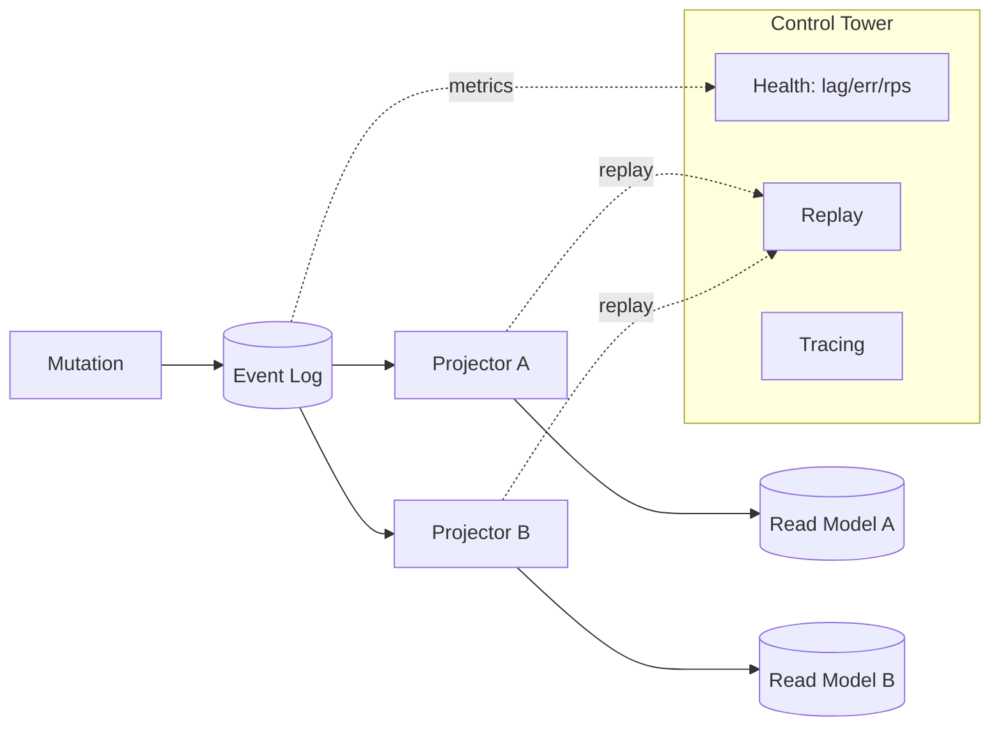

# 愿景与架构

Atomo 是下一代 Content Core（内容核心，简称 cc）：它不是被动的 CMS“仓库”，而是驱动业务的“方舟反应堆”。Atomo 将内容视为“活的事件流”，用强类型的可组合内容块来构建体验，并提供一个可扩展的“能量枢纽”（预留 WASM）以承载自动化与集成。它以 Rust 为基石，追求性能、安全与“可运营的确定性”；并以“Schema 驱动”的方式，将声明转化为可运行的系统。

- Content Core，而非 CMS：从“存内容”走向“以内容驱动业务”。
- Rust 基石：高吞吐、低时延、内存安全。
- Schema 驱动：一次声明，生成后端、GraphQL、Admin UI 与 SDK 类型。

## 核心隐喻（Core Metaphors）

- 方舟反应堆（Arc Reactor）：Rust + 事件溯源构成可靠、高性能的核心。
- 事件之河（River of Events）：将状态变更建模为不可变事件，解锁审计、时间旅行与可靠读模型。
- 流动的画布（Flowing Canvas）：Notion‑like 的强类型块，突破表单束缚，实现自由组合。
- 能量枢纽（Energy Hub）：标准化、可治理的扩展面（WASM 设计），承载业务逻辑与集成。

## 指导哲学（Guiding Philosophy）

- 本地优先（Local‑First）：用户侧就近“真理之源”，更强韧性的体验；云端负责同步/协作。
- 实时协作（Real‑Time）：以 CRDT 与订阅为底座，支持细粒度多人协作。
- 声明式开发（Declarative）：用 TypeScript DSL 声明模型、访问、钩子与工作流；工具链生成并编排高性能服务。

## 架构总览（Architecture Overview）

### Monorepo 与模块（Monorepo and Modules）

- `crates/`：Rust 工作区——`atomo_core`、`atomo_server`、`atomo_cli`、schema/代码生成工具、WASM 运行时脚手架。
- `packages/`：Admin UI 与 TypeScript SDK。
- `services/`：服务实例（如 CRM），包含 `schema.ts`、插件、工作流与生成物。
- `docs/`：VitePress 文档；`tests/`、`migrations/` 共享资产。

### 核心运行时：事件溯源 + CQRS（Core Runtime: ES + CQRS）

- 写入路径：所有变更以不可变事件追加至事件日志；
- 读取路径：通过投影（Projection）派生读模型以服务查询；
- 保证：完整审计、历史查询与确定性恢复（从日志回放）；
- 平台 Schema（用户、会话、审计）与服务 Schema 合并为统一 GraphQL。

事件模型速览（Event model primer）
- 事件流：按聚合或上下文组织的有序事件。
- 投影器：幂等处理器，构建表/索引/缓存等读模型。
- 时间旅行：按检查点回放，查询历史状态。
- 审计：受限投影与 API，暴露跨域的变更历史。

深化（Deepening）
- 事件版本与升版：Schema 演进时，旧事件在读取路径由 Upcaster 适配到最新形态；与事件类型同目录维护，版本号策略明确。
- 投影检查点与幂等：每个投影器维护独立检查点（名称/流/偏移或时间戳）；幂等保证重复投递不破坏读模型；可从任意检查点安全重放。
- 事务边界：命令校验与事件追加原子化；外部副作用（通知/搜索）交由投影/作业处理，读端采用最终一致性。

### 即时编译的服务运行时（Instantly‑Compiled Service Runtime）

运行 `atomo dev`（单服务或工作区模式）时，Atomo 为该服务构建“专属” Rust 二进制：

1) 解析服务 Schema：读取 `services/<name>/schema.ts`（含平台模块）。
2) 生成 Rust：模型、GraphQL 解析器、访问钩子、元数据端点。
3) 组装运行时：于 `.atomo/runtime` 生成标准 `Cargo.toml` 与 `src/main.rs`，注入生成代码。
4) 编译：利用 Cargo 增量编译加速重建。
5) 热重载：监听 TS/Rust 变更，快速代码生成与重启。
6) 开发便捷：GraphQL IDE（`/graphql`）、元数据（`/meta/schema`）、`GET /schema.ts`；工作区模式代理 Admin UI 至 `/admin`。

端点与路径（Endpoints and paths）
- 源 Schema：`services/<name>/schema.ts`
- 生成工作区：`services/<name>/.atomo/runtime/`
- GraphQL IDE：`/graphql`（服务）或 `/playground`（工作区）
- 元数据 API：`/meta/schema`（JSON），`GET /schema.ts`（开发）
- Admin UI 代理：`/admin`（工作区）

开发流水线（Mermaid）
```mermaid
graph TD
  A[schema.ts] -->|codegen| B[生成的 Rust]
  B --> C[.atomo/runtime]
  C -->|cargo build| D[服务二进制]
  D --> E[/graphql & /meta/schema]
  D --> F[/admin 代理]
```

### TypeScript DSL（TypeScript DSLs）

- Schema DSL（`schema.ts`）
  - 实体、关系、联合/块、校验；
  - 访问控制（类似 RBAC/ABAC）与生命周期钩子；
  - 强类型可组合内容（Blocks）支撑“流动的画布”。

- Workflow DSL
  - 面向长事务、跨服务的异步编排；代码而非 YAML；支持重试、Saga 补偿模式。

- 设计令牌（Design Tokens）
  - 平台无关的样式原子，编译为 CSS 变量/Tailwind/Swift/Android 资源，保证跨端一致性。

示例（Sketch）
```ts
// services/crm-service/schema.ts（示意）
export type Role = 'Admin' | 'Manager' | 'Sales' | 'Support' | 'Viewer'

export interface Company { id: string; name: string; industry?: string }

export interface Contact {
  id: string
  name: string
  email?: string
  company?: Company
  notes: Block[]
}

export type Block =
  | { type: 'Paragraph'; text: string }
  | { type: 'CallLog'; at: Date; summary: string }

export const access = {
  Contact: {
    read: ({ role }: { role: Role }) => role !== 'Viewer' ? ['id','name'] : ['id','name','email','company'],
    update: ({ role }: { role: Role }) => role === 'Admin' || role === 'Manager'
  }
}
```

Workflow DSL（示意）
```ts
export const workflow = defineWorkflow('OrderFlow')
  .step('charge', async (ctx) => {
    const res = await ctx.payments.charge(ctx.orderId)
    if (!res.ok) throw new RetryableError('charge failed')
    return res.txId
  })
  .step('fulfill', async (ctx, txId) => {
    const ok = await ctx.fulfillment.ship(ctx.orderId)
    if (!ok) throw new Compensate('ship failed', { txId })
  })
  .compensation(async (ctx, { txId }) => {
    await ctx.payments.refund(txId)
  })
```

### GraphQL 与 Admin UI（GraphQL and Admin UI）

- 动态 GraphQL：为 CRUD 与关系生成解析器；平台 Schema（用户/会话/审计）合并。
- 元数据端点驱动 Admin UI 动态渲染（列表、详情、输入、关系、块）。
- 工作区模式：后端代理 Admin UI 于 `/admin`；Playground 于 `/playground`。

### SDK 与本地优先运行时（SDKs and Local‑First Runtime）

- TypeScript SDK：生成类型与 React hooks（@tanstack/react‑query）；与服务端类型对齐。
- 同步 SDK（设计方向）：
  - 端侧持久化（SQLite）与高效变更日志；
  - CRDT 引擎（yrs/y‑crdt）无冲突合并；
  - 后台同步、断点续传；默认乐观 UI；
  - 安全会话集成与选择性订阅以节能。

细节（Details）
- 冲突模型：文本/富结构 CRDT（Yrs）；可按模型约定 LWW 或字段级 CRDT。
- 同步协议：基于版本向量/游标的增量 push/pull，支持断点与去重；服务端按会话权限过滤流。
- 本地持久化：SQLite + 变更日志队列；可选加密（依平台）与租户分区；重启后快速恢复。

### Hydra UI（设计）（Hydra UI, Design）

- 将平台无关的 UI 逻辑（状态机/数据获取/派生）编译为 WASM；
- 薄渲染层（Web‑React、iOS‑SwiftUI、Android‑Compose）仅订阅状态并渲染；
- 价值：100% 复用复杂 UI 逻辑，同时具备原生性能与体验。

状态与边界（Status & boundaries）
- 状态：设计/规划中（当前已落地 Admin UI 动态渲染路径）。
- 边界：WASM 暴露状态/副作用通道；平台渲染器只负责 UI 转绘，不直接写业务，提升可测与可替换性。

### 扩展性与插件（Extensibility and Plugins）

- WASM 运行时（进行中）：已定义 Manifest/Permission/PluginContext；计划以 wasmtime 提供沙箱执行。
- 生命周期钩子：在关键点注入类型安全逻辑。
- ABI 考量：事件/模型接口力求稳定，支持多语言（Rust/TS/Go/C#）。

能力模型与清单（示例）
```json
{
  "name": "content-auto-tag",
  "version": "0.1.0",
  "permissions": [
    { "cap": "net.fetch", "domains": ["https://api.example.com"] },
    { "cap": "clock.now" },
    { "cap": "env.read", "vars": ["OPENAI_API_KEY"] }
  ],
  "events": ["ContentCreated", "ContentUpdated"]
}
```
- 资源预算：为插件设置 CPU/内存上限与超时；越界即终止，防噪声邻居。
- 审核/签名：建议签名与来源校验，降低供应链风险。

## 安全、认证与权限（Security, Auth, and Permissions）

- 认证：JWT 签发/校验，会话存储于 Postgres；REST：`/auth/login`、`/auth/logout`、`/auth/me`。
- 角色：`Admin | Manager | Sales | Support | Viewer` 等 RBAC 模式。
- 密码哈希：代码中已使用 argon2id（仍兼容验证旧的 bcrypt 哈希）；生产环境务必启用策略门禁（见“路线图 → Docs vs Code”）。
- 访问控制：Schema 声明规则；在 GraphQL 解析器与生成层强制执行。

多租户与合规（Multi‑tenancy & compliance）
- 多租户：
  - 行级（PG RLS）：`tenant_id` + RLS 强隔离（推荐默认）。
  - 每租户独立 Schema：更强隔离但迁移/运维成本高，适合小规模高隔离场景。
- PII：字段分级；日志脱敏；DSAR 导出/删除通过事件式工作流；审计保证可追踪。

## 运营与可观测性（控制塔）（Operations & Observability, Control Tower）

- 事件浏览器：探索事件历史与实体时间线——业务“时间机器”。
- 投影器健康：实时查看延迟（时间/偏移）、吞吐、错误率。
- 分布式追踪：从 GraphQL Mutation → 校验 → 事件追加 → 投影更新的端到端链路（OpenTelemetry）。
- 恢复剧本：
  - 投影回放：清理污染读模型，基于不可变日志重建；
  - 补偿事件：不篡改历史前提下修正错误；
  - 升版：旧事件内存适配为新版本以保持兼容。

运营承诺（Operational promises）
- 可运营确定性：每次业务操作均可记录与审计；
- 自愈：事件日志始终“纯净”，读侧错误可修复；
- 深度洞察：纵览业务演化。

指标与 SLO（建议）（Metrics & SLOs）
- 指标：投影延迟（ms/偏移）、事件吞吐（ev/s）、回放时长、错误率、订阅更新延迟。
- 参考 SLO：单区开发态 P99 从 Mutation 到读模型 < 500ms；回放 ≥ 10k ev/min；审计查询 P95 < 150ms。

控制塔示意（Mermaid）


## 开发者体验（DX, Developer Experience）

- CLI 命令：
  - `init`：初始化服务或工作区（支持模板）；
  - `generate`：基于 Schema 进行代码生成；
  - `migrate`：数据库迁移；
  - `dev`：编译并运行服务，支持热重载；
  - `codegen`：前端类型生成（SDK）；
  - `dev --workspace`：监听核心 crates 与服务 Schema；代理 Admin UI。

- 黄金路径（示例）
  1) `atomo init my-crm --template crm`
  2) 在 `services/crm-service/schema.ts` 建模
  3) `atomo generate && atomo migrate`
  4) `atomo dev`（或仓库根运行 `atomo dev --workspace`）
  5) 迭代 `/admin`（UI），在 `/graphql` 或 `/playground` 调试 API
  6) `atomo codegen` 更新 SDK 类型与 hooks

- 当前 MVP 循环
  1) 在 `services/crm-service/schema.ts` 建模
  2) 用 `pnpm --filter atomo-crm-service generate` 重新生成 CRM demo artifacts
  3) 用 `pnpm --filter @atomo/client-sdk build` 或 `pnpm --filter @atomo/client-sdk dev` 构建/监听 SDK 类型
  4) 用 `pnpm dev:admin` 检查 Admin UI 行为
  5) 用 `pnpm --filter "./packages/*" test` 保持 Admin UI 与 SDK type-check 通过

相关阅读（See also）
- 指南 → 事件溯源：`/guide/event-sourcing`
- 指南 → 开发运行时与工作区：`/guide/dev-runtime`
- 指南 → 基于 Schema 的开发：`/guide/schema-driven`
- 指南 → 安全与认证：`/guide/advanced/security`
- 指南 → 插件（WASM）：`/guide/plugins`

## 策略速览（Strategy Snapshot）

- 目标用户：高级全栈开发者；追求类型安全/性能/可扩展的团队；重视审计与“可运营确定性”的企业。
- 生态方向：“解决方案即代码”模板，WASM 插件接口与市场。
- Why Atomo vs CMS：强类型可组合块；ES/CQRS 审计；Rust 性能；Schema→运行时自动化；WASM 扩展；开发者优先的 DX。

## 与路线图的关系（Relationship to Roadmap）

愿景相对稳定，仅在战略转折时变化；交付状态、阶段与时间表请见《路线图》。

- 路线图：`/zh/roadmap`
